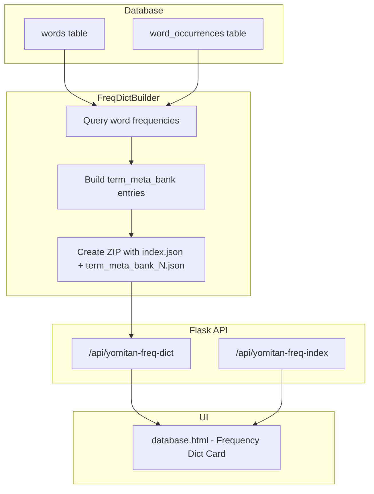

# Design Document: Yomitan Frequency Dictionary

## Overview

This feature adds a Yomitan-compatible frequency dictionary to GSM, allowing users to download a dictionary of their known words with occurrence counts. The frequency dictionary uses the `term_meta_bank` format (distinct from the existing character dictionary's `term_bank` format). Both dictionaries are updated to use UNIX timestamps as revisions for reliable auto-updating in Yomitan.

The implementation follows the existing patterns established by the character dictionary: a builder class produces an in-memory ZIP, Flask endpoints serve the ZIP and index metadata, and the database.html page provides the download UI.

## Architecture



## Components and Interfaces

### 1. FrequencyDictBuilder (new class)

Location: `GameSentenceMiner/util/yomitan_dict/freq_dict_builder.py`

This is a new, standalone builder class. It does not extend `YomitanDictBuilder` because the output format is fundamentally different (`term_meta_bank` vs `term_bank`, no images, no tags, no structured content).

```python
class FrequencyDictBuilder:
    DICT_TITLE = "GSM Frequency Dictionary"

    def __init__(self, download_url: str | None = None):
        self.download_url = download_url
        self.entries: list[list] = []  # term_meta_bank entries

    def build_from_db(self) -> None:
        """Query words + word_occurrences, populate self.entries."""
        ...

    def _create_index(self) -> dict:
        """Create index.json with frequencyMode, UNIX timestamp revision, etc."""
        ...

    def export_bytes(self) -> bytes:
        """Create ZIP in memory with index.json + term_meta_bank_N.json files."""
        ...
```

Key design decisions:
- Separate class rather than extending `YomitanDictBuilder` — the character dict builder is tightly coupled to VNDB character data, images, name parsing, and structured content. A frequency dict has none of that.
- The builder queries the database directly using `WordsTable._db.fetchall()` with a single JOIN + GROUP BY query for efficiency.
- Entries are stored as `["word", "freq", {"frequency": N, "reading": "reading"}]` per Yomitan's `term_meta_bank` format.

### 2. API Endpoints (yomitan_api.py extension)

Two new routes added to the existing `register_yomitan_api_routes` function:

| Endpoint | Method | Returns | Guard |
|---|---|---|---|
| `/api/yomitan-freq-dict` | GET | ZIP file | tokenisation enabled + data exists |
| `/api/yomitan-freq-index` | GET | JSON index | tokenisation enabled |

Both endpoints check `is_tokenisation_enabled()` and return 404 with a descriptive message if disabled.

### 3. Revision Update (dict_builder.py modification)

The existing `YomitanDictBuilder.__init__` changes from:
```python
self.revision = revision or str(random.randint(100000000000, 999999999999))
```
to:
```python
self.revision = revision or str(int(time.time()))
```

This is a one-line change. The `FrequencyDictBuilder` also uses `str(int(time.time()))` for its revision.

### 4. UI Card (database.html addition)

A new card is added to the `management-grid` div, similar in structure to the existing Yomitan character dictionary card. It includes:
- A download button that calls `/api/yomitan-freq-dict`
- A message shown when tokenisation is not enabled (checked via `/api/tokenisation/status`)
- Error handling for the download action

### 5. Package __init__.py Update

Export `FrequencyDictBuilder` from `GameSentenceMiner/util/yomitan_dict/__init__.py`.

## Data Models

### Frequency Entry Format (term_meta_bank)

Each entry in `term_meta_bank_N.json`:
```json
["食べる", "freq", {"frequency": 42, "reading": "たべる"}]
```

Fields:
- `[0]` — word (string): the headword from `words.word`
- `[1]` — type marker (string): always `"freq"`
- `[2]` — data (object): `{"frequency": N, "reading": "..."}` where N is the count of rows in `word_occurrences` for that `word_id`, and reading comes from `words.reading`

If a word has no reading (empty string in DB), the entry simplifies to:
```json
["食べる", "freq", 42]
```

### index.json for Frequency Dictionary

```json
{
  "title": "GSM Frequency Dictionary",
  "revision": "1719500000",
  "format": 3,
  "frequencyMode": "occurrence-based",
  "author": "GameSentenceMiner",
  "description": "Word frequency data from your GSM database",
  "downloadUrl": "http://127.0.0.1:{port}/api/yomitan-freq-dict",
  "indexUrl": "http://127.0.0.1:{port}/api/yomitan-freq-index",
  "isUpdatable": true
}
```

### SQL Query for Frequency Data

```sql
SELECT w.word, w.reading, COUNT(wo.id) as freq
FROM words w
INNER JOIN word_occurrences wo ON w.id = wo.word_id
GROUP BY w.id
HAVING freq > 0
ORDER BY freq DESC
```

The `INNER JOIN` naturally excludes orphaned words with zero occurrences. `ORDER BY freq DESC` is for human readability of the output; Yomitan doesn't require ordering.


## Correctness Properties

*A property is a characteristic or behavior that should hold true across all valid executions of a system — essentially, a formal statement about what the system should do. Properties serve as the bridge between human-readable specifications and machine-verifiable correctness guarantees.*

### Property 1: Round-trip serialization

*For any* list of valid word-frequency-reading triples, serializing them into a ZIP via `FrequencyDictBuilder` then reading back the ZIP and parsing the `index.json` and all `term_meta_bank_N.json` files SHALL produce an equivalent set of entries and equivalent index metadata.

**Validates: Requirements 6.4**

### Property 2: Index metadata completeness

*For any* frequency dictionary produced by `FrequencyDictBuilder`, the `index.json` SHALL contain: `title` equal to `"GSM Frequency Dictionary"`, `format` equal to `3`, `frequencyMode` equal to `"occurrence-based"`, `author` equal to `"GameSentenceMiner"`, and when a `download_url` is provided, `downloadUrl`, `indexUrl`, and `isUpdatable: true`.

**Validates: Requirements 1.3, 1.4, 1.5, 6.3**

### Property 3: Entry format correctness

*For any* word with a non-empty reading and a positive occurrence count, the corresponding entry in the `term_meta_bank` SHALL be `[word, "freq", {"frequency": count, "reading": reading}]`. *For any* word with an empty reading, the entry SHALL be `[word, "freq", count]`.

**Validates: Requirements 1.2, 5.2**

### Property 4: Frequency count accuracy

*For any* set of words and word occurrences inserted into the database, the frequency count for each word in the generated dictionary SHALL equal the number of distinct occurrences for that word in the `word_occurrences` table.

**Validates: Requirements 5.1**

### Property 5: UNIX timestamp revision (frequency dictionary)

*For any* frequency dictionary produced by `FrequencyDictBuilder`, the `revision` field in `index.json` SHALL be a string representing a valid UNIX timestamp (integer seconds since epoch) that is within a reasonable window of the current time.

**Validates: Requirements 3.1**

### Property 6: UNIX timestamp revision (character dictionary)

*For any* character dictionary produced by `YomitanDictBuilder` without an explicit revision parameter, the `revision` field in `index.json` SHALL be a string representing a valid UNIX timestamp (integer seconds since epoch) that is within a reasonable window of the current time.

**Validates: Requirements 3.2**

### Property 7: Entry chunking

*For any* frequency dictionary with more than 10,000 entries, the ZIP SHALL contain multiple `term_meta_bank_N.json` files, each containing at most 10,000 entries, and the union of all entries across all files SHALL equal the complete set of entries.

**Validates: Requirements 6.2**

## Error Handling

| Scenario | Response | HTTP Code |
|---|---|---|
| Tokenisation not enabled | JSON error: `"Tokenisation must be enabled to use the frequency dictionary"` | 404 |
| No word data in database | JSON error: `"No frequency data available. Play some games with tokenisation enabled."` | 404 |
| Database query failure | JSON error with exception details, logged via `logger.error()` | 500 |
| ZIP creation failure | JSON error with exception details, logged via `logger.error()` | 500 |

All error responses include CORS headers (`Access-Control-Allow-Origin: *`) for consistency with existing endpoints.

## Testing Strategy

### Property-Based Testing

Library: `hypothesis` (Python). Each property test runs a minimum of 100 examples.

Property tests focus on the `FrequencyDictBuilder` class in isolation (no Flask, no real database). Test data is generated using Hypothesis strategies for Japanese-like strings, readings, and frequency counts.

Each test is tagged with: **Feature: yomitan-frequency-dict, Property N: {title}**

### Unit Tests

Unit tests cover:
- API endpoint integration (Flask test client with mocked database/tokenisation)
- Error conditions (tokenisation disabled, empty data)
- Edge cases (words with empty readings, orphaned word records, exactly 10,000 entries boundary)
- Character dictionary revision change (verify `time.time()` is used instead of `random.randint`)

### Test Organization

- Property tests: `tests/util/yomitan_dict/test_freq_dict_builder_properties.py`
- Unit tests: `tests/util/yomitan_dict/test_freq_dict_builder.py`
- API tests: `tests/web/test_yomitan_freq_api.py`
