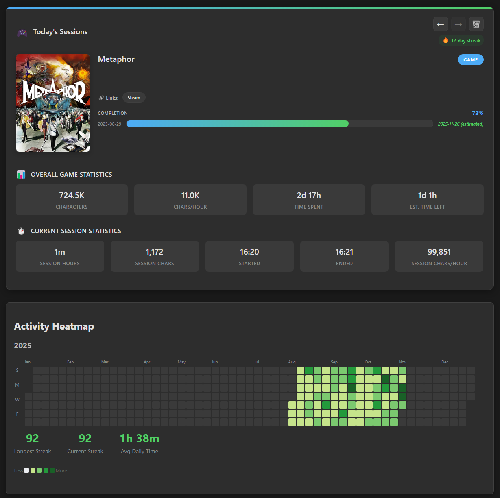
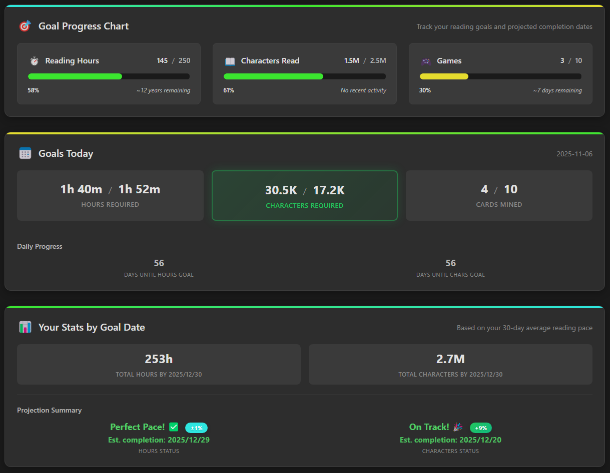
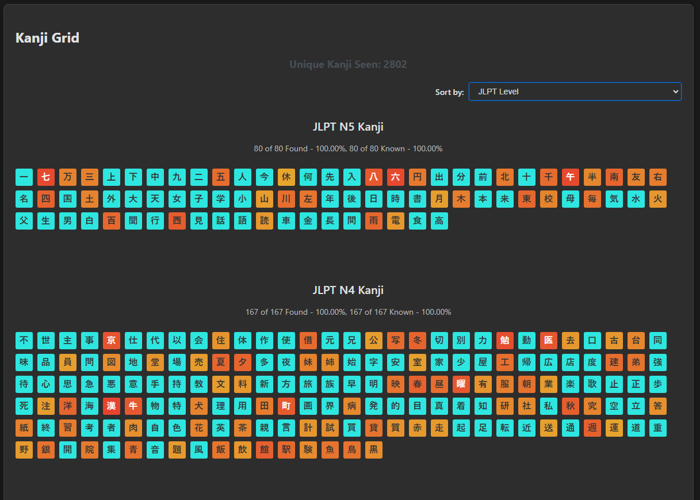
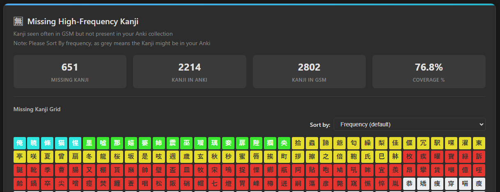
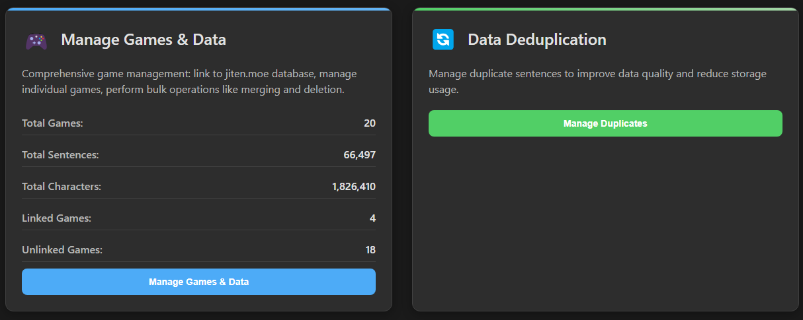

    

# GSM - An Immersion toolkit for Games.

### English | [日本語](docs/ja/README.md) | [简体中文](docs/zh/README.md).

An application designed to assist with language learning through games.

Short Demo (Watch this first): https://www.youtube.com/watch?v=FeFBL7py6HY

Installation: https://www.youtube.com/watch?v=sVL9omRbGc4

Discord: https://discord.gg/yP8Qse6bb8

## Features - [Anki Card Enhancement](#anki-card-enhancement) | [OCR](#ocr) | [Overlay](#overlay) | [Stats](#stats)

### Anki Card Enhancement

GSM significantly enhances your Anki cards with rich contextual information:

* **Automated Audio Capture**: Automatically records the voice line associated with the text.

  * **Automatic Trim**: Some simple math around the time that the text event came in, in combination with a "Voice Activation Detection" (VAD) library gives us neatly cut audio.
  * **Manual Trim**: If Automatic voiceline trim is not perfect, it's possible to [open the audio in an external program](https://youtu.be/LKFQFy2Qm64) for trimming.

* **Screenshot**: Captures a screenshot of the game at the moment the voice line is spoken.

* **Multi-Line**: It's possible to capture multiple lines at once with sentence audio with GSM's very own Texthooker.

* **AI Translation**: Integrates AI to provide quick translations of the captured sentence. Custom Prompts also supported. (Optional, Bring your own Key)

#### Game Example (Has Audio)

https://github.com/user-attachments/assets/df6bc38e-d74d-423e-b270-8a82eec2394c

---

#### VN Example (Has Audio)

https://github.com/user-attachments/assets/ee670fda-1a8b-4dec-b9e6-072264155c6e

---

### OCR

GSM runs a fork of [OwOCR](https://github.com/AuroraWright/owocr/) to provide accurate text capture from games that do not have a hook. Here are some improvements GSM makes on stock OwOCR:

* **Easier Setup**: With GSM's managed Python install, setup is only a matter of clicking a few buttons.

* **Exclusion Zones**: Instead of choosing an area to OCR, you can choose an area to exclude from OCR. Useful if you have a static interface in your game and text appears randomly throughout.

* **Two-Pass OCR**: To cut down on API calls and keep output clean, GSM features a "Two-Pass" OCR System. A Local OCR will be constantly running, and when the text on screen stabilizes, it will run a second, more accurate scan that gets sent to clipboard/WebSocket.

* **Consistent Audio Timing**: With the two-pass system, we can still get accurate audio recorded and into Anki without the use of crazy offsets or hacks.

* **More Language Support**: Stock OwOCR is hard-coded to Japanese, while in GSM you can use a variety of languages.

https://github.com/user-attachments/assets/07240472-831a-40e6-be22-c64b880b0d66

---

### Overlay

GSM also features an overlay that allows for on-screen yomitan lookups. Whenever the overlay is on it will scan the screen ONCE whenever a text event from any source comes into GSM. It then allows for hovering over the actual characters in-game for yomitan lookups, and mining.

https://youtu.be/m1MweBsHbwI

<!--### Game Launcher Capabilities (WIP)

This is probably the feature I care least about, but if you are lazy like me, you may find this helpful.

* **Launch**:  GSM can launch your games directly, simplifying the setup process.

* **Hook**:  Streamlines the process of hooking your games (Agent).

This feature simplifies the process of launching games and (potentially) hooking them, making the entire workflow more efficient.

-->
---

### Stats

GSM has a statistics page with currently **32 graphs** chock full of pretty data.

The stats are not just pretty.

They are designed to help you grow.

Set goals and see exactly what daily tasks you need to do to achieve them:

See all the Kanji you've read in whatever order you want:

And click on them to see every sentence you've read with that Kanji:

Use Anki? Find Kanji you read a lot but aren't in Anki yet

Clean up your data, anyway you want with advanced tools.

These statistics aren't just meant to look pretty, they are meant to help you answer questions:
* What can I play to maximise both fun and learning?
* Do I read better in the evening, or in the mornings?
* Am I progressing in this language?
* How long should I immerse to reach my goals?

## Basic Requirements

* **Anki card creation tool**: [Yomitan](https://github.com/yomidevs/yomitan), [JL](https://github.com/rampaa/JL), etc.

* **A method of getting text from the game**: [Agent](https://github.com/0xDC00/agent), [Textractor](https://github.com/Artikash/Textractor), [LunaTranslator](https://github.com/HIllya51/LunaTranslator), GSM's OCR, etc.

* **A game :)**

## Documentation

For help with installation, setup, and other information, please visit the project's [Wiki](https://github.com/bpwhelan/GameSentenceMiner/wiki).

## FAQ

### How Does It Work?

This is a common question, and understanding this process will help clarify any issues you might encounter while using GSM.

1.  The beginning of the voice line is marked by a text event. This usually comes from Textractor, Agent, or another texthooker. GSM can listen for a clipboard copy and/or a WebSocket server (configurable in GSM).

2.  The end of the voice line is detected using a Voice Activity Detection (VAD) library running locally. ([Example](https://github.com/snakers4/silero-vad))

In essence, GSM relies on accurately timed text events to capture the corresponding audio.

GSM provides settings to accommodate less-than-ideal hooks. However, if you experience significant audio inconsistencies, they likely stem from a poorly timed hook, loud background music, or other external factors, rather than GSM itself. The core audio trimming logic has been stable and effective for many users across various games.

## Contact

If you encounter issues, please ask for help in my [Discord](https://discord.gg/yP8Qse6bb8) or create an issue here.

## Acknowledgements

* [OwOCR](https://github.com/AuroraWright/owocr) for their outstanding OCR implementation, which I've integrated into GSM.

* [chaiNNer](https://github.com/chaiNNer-org/chaiNNer) for the idea of installing Python within an Electron app.

* [OBS](https://obsproject.com/) and [FFMPEG](https://ffmpeg.org/), without which GSM would not be possible.

* [Renji's Texthooker](https://github.com/Renji-XD/texthooker-ui)

* https://github.com/Saplling/transparent-texthooker-overlay

* [exSTATic](https://github.com/KamWithK/exSTATic) for inspiration for GSM's Stats.

* [Kanji Grid](https://github.com/Kuuuube/kanjigrid)

* [Jiten.moe](https://jiten.moe) for metadata

* [MeikiOCR](https://github.com/rtr46/meikiocr) by [rtr46](https://github.com/rtr46). Make sure to check out his cool project [Meikipop](https://github.com/rtr46/meikipop) if you need something simpler than GSM Overlay.

## Donations

If you've found this or any of my other projects helpful, please consider supporting my work through [GitHub Sponsors](https://github.com/sponsors/bpwhelan), or [Ko-fi](https://ko-fi.com/beangate).

