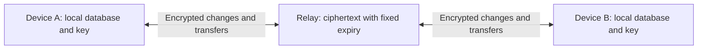

# Encrypted device sync

GSM now supports an end-to-end encrypted, expiring relay. Local SQLite databases
remain the durable source of data. The default relay lifetime is 30 days; a
self-hosted operator can shorten it. This is a custom versioned sync protocol
using conventional building blocks: a transactional outbox, immutable event IDs,
cursor-based downloads, deterministic register merges, encrypted checkpoints,
and explicit recovery when history expires.

## Options considered

| Design | Advantages | Costs |
| --- | --- | --- |
| Keep the current full database service, encrypt its records | Easiest recovery for devices offline indefinitely | Still retains a full cloud copy indefinitely and needs permanent hosting |
| Direct peer-to-peer sync, with rendezvous/relay for connectivity | No persistent cloud sentence storage | Devices generally need overlapping availability; discovery, NAT traversal and pairing are a larger subsystem |
| User-owned WebDAV/S3/file storage | User controls the storage provider | Usually still keeps a permanent copy; concurrent writes, permissions and deletion semantics vary |
| Encrypted relay with bounded history and on-demand checkpoints | Asynchronous sync, a simple self-hosted deployment, bounded cloud content | Long-offline/new devices sometimes need an up-to-date source device |

The fourth option is implemented. It reuses GSM's database and background sync
entry point, and adds a Cloudflare Durable Object relay to the existing Worker
repository. Sync still needs a reachable relay to exchange data. GSM itself and
local editing remain usable while the relay is unavailable. This does not add
direct peer-to-peer transport or depend on a mandatory GSM-hosted account.



## Desktop setup

Open **Settings → Advanced → Encrypted device sync…**.

1. Enter the relay URL. Use HTTPS; localhost HTTP is supported for development.
2. Enter the self-hosted relay's access token, or leave it blank to use an
   existing GSM Cloud sign-in with the hosted Worker.
3. Generate a pairing key on the first device. Save it privately, then paste the
   same key on the other devices. The access token and pairing key are separate.
4. Enable sync and run **Sync now** on the source device. Its first completed
   sync publishes an encrypted device transfer automatically.
5. Sync the other device. Enable automatic sync if desired.

The key is a randomly generated 256-bit secret, not a password. GSM derives a
separate encryption key using HKDF-SHA256 and encrypts with AES-256-GCM, a fresh
96-bit nonce, and authenticated message context. The pairing key never leaves
the desktop. Store it with your local backups: losing it prevents decrypting
old relay contents. Generating a different key creates a different sync group.
Removing a device from a group requires a new key for the remaining devices.
Local configuration files/backups contain the pairing key and must be protected.

No line data is uploaded merely by signing into GSM Cloud. Sync must be enabled
and configured explicitly. A missing key never triggers a plaintext fallback.

## What syncs

Game lines sync the existing portable fields: ID, game name, sentence text,
language, timestamp, Anki note IDs and modification time. Images, audio, video,
machine-specific media paths, derived game links and translations are not
transferred. Existing local media fields survive incoming line updates.

Settings sync is off by default. The dialog can opt into three independent
groups for the **Default profile**:

- Native and target language.
- Anki field names and their enabled/overwrite/append preferences.
- Text-processing options, processor order and replacement rules.

Credentials, API URLs/keys, paths, ports, OBS/capture devices, hotkeys, sync
configuration, overlay geometry and named profiles stay local. The allowlist is
explicit, so adding a new configuration field does not automatically upload it.
Incoming values are checked against the allowlist and type/size constraints.
Opting out removes unsent preferences from the outbox and excludes them from
new transfers. Previously uploaded ciphertext retains its original expiry.
Open settings editors merge incoming preferences without discarding local edits.
Profiles with game-specific overrides are deliberately outside this first scope.

## Conflicts, retries and recovery

Each line and each portable preference is a register with a Lamport counter and
a writer-ID tie-breaker. Observed changes advance the local counter. Simultaneous
edits converge deterministically without depending on synchronized wall clocks.
For edits to the same line, one complete portable line wins; this is not a
character-level collaborative editor. Different preference keys merge separately.
Writer IDs are random per process, so copying a database does not clone a writer.

SQLite triggers capture local edits. An immutable outbox event, including its
encrypted payload, survives process restarts and uncertain network responses.
Acknowledgements remove exact event IDs. An edit made during an upload receives
a separate event and remains queued. Imported records, local conflict decisions,
acknowledgements and the download cursor commit together in a SQLite transaction.
Authenticated or malformed pages fail without acknowledging uploads or advancing
the cursor. Tombstones remain on devices and are included in transfers, preventing
old snapshots from resurrecting deleted lines.

The Worker serializes changes within each sync group. A generation identifies
the relay incarnation and an expiry floor identifies lost history. A stale
device cannot quietly jump to a new cursor. It downloads an authenticated,
chunked checkpoint when available, stages all chunks locally, merges them only
after the complete transfer validates, and then reads later changes. Checkpoint
identity, generation, base cursor, part count and part index are authenticated.
New and returning devices keep unique local lines and locally recorded edits.

If a transfer is missing or expired, run **Prepare device transfer** on an
up-to-date device, then sync the returning device. Transfers are created on demand
and are not refreshed in the background. A current device does not need a
permanent cloud snapshot to keep using incremental sync.

After the whole relay has expired or been removed, choose **Rebuild an empty
relay from this device…** on an up-to-date device. This explicit action can seed
an empty relay; it cannot skip changes in a populated relay. If no device has a
complete copy, restore a local backup first. Sync is not an indefinite cloud backup.

**Remove relay data…** clears the group's active relay storage and disables sync
on that device. Other devices need a new transfer before continuing. It does not
delete local databases or historical v1 D1 databases.

## Retention and privacy boundaries

Each encrypted event has a fixed expiry from its first accepted upload. Replaying
the same ID, reading data, or leaving a device offline does not extend that expiry.
Checkpoints also have fixed lifetimes; abandoned uploads expire within one hour
or the configured relay lifetime, whichever is shorter. Only the latest committed
checkpoint is retained; publishing a replacement removes the prior active copy.
There is a 256 MiB ciphertext quota per group, a 1 MiB request limit, a 100-event
page limit and a 1,024-part checkpoint limit. Very large datasets can require a
local database transfer rather than fitting into this bounded relay.

Alarms perform cleanup without a client returning. Requests also prune expired
rows before serving data. Alarms reschedule cleanup after an error as well as
using the platform's retries. While a group is active, only its opaque generation,
sequence and byte-count metadata can outlive the content window. After a full
retention window without a successful request, `deleteAll()` removes the group's
active storage and metadata. A later request creates a new generation.

These are **application availability/retention limits**, not a promise that all
physical provider copies disappear at that instant. Cloudflare documents a
[30-day point-in-time recovery window for SQLite Durable Objects](https://developers.cloudflare.com/durable-objects/api/sqlite-storage-api/#pitr-point-in-time-recovery-api).
Provider backups may therefore outlive the app's deletion. The provider sees
ciphertext size, timing, opaque group IDs, and the access identity/IP. It never
receives the pairing/encryption key or plaintext game/settings contents. A relay
can withhold data; encryption authenticates contents, not the server's availability
or completeness. Compromised paired devices already possess the group key.

The implementation follows Cloudflare's
[SQLite storage and transaction API](https://developers.cloudflare.com/durable-objects/api/sqlite-storage-api/)
and [alarm lifecycle](https://developers.cloudflare.com/durable-objects/api/alarms/),
and uses the `cryptography` library's
[authenticated encryption API](https://cryptography.io/en/latest/hazmat/primitives/aead/).

## Worker deployment

Worker sources are in the sibling repository:

```text
C:\Users\Beangate\GSM\cloudflare workers\gsm-sync
```

There are two deployments sharing `src/sync/relay.mjs`:

- Existing GSM API: `src/index.ts` routes `/api/sync/v2/:room/*` after verifying
  bearer authentication and the account's `can_sync` flag. No per-user D1 creation
  or Cloudflare management token is needed for v2 payload storage.
- Standalone relay: `wrangler.relay.jsonc` requires a separate `SYNC_TOKEN` secret
  with at least 32 characters, and has no GSM account/D1/auth-service dependency.
  Anyone with that token can access this relay; use it for a trusted personal
  group and do not distribute one personal token as a public multi-user service.

From the Worker repository:

```powershell
npm ci
npx wrangler secret put SYNC_TOKEN --config wrangler.relay.jsonc
npm run deploy:relay
```

Generate a strong random access token locally and enter it at the secret prompt;
do not reuse the pairing key. Set `SYNC_RETENTION_SECONDS` to `604800` for seven
days, or keep `2592000` for thirty days. The Worker caps it at thirty days. A
deployment change applies to newly uploaded content; remove existing relay data
if an immediate retention-policy reset is required. The standalone config disables
Worker observability. Operators should also avoid request-body logging elsewhere.

Deployment readiness can be checked without publishing:

```powershell
npx wrangler deploy --dry-run --config wrangler.relay.jsonc
npx wrangler deploy --dry-run
npm run test:sync
```

The existing GSM API config adds a SQLite Durable Object binding and a `sync-v2`
migration. Deploy it using the existing project's normal release process.

## Migrating v1 and retiring old cloud copies

The new code does **not** automatically delete already-stored plaintext data.
This requires an explicit migration by the operator after validating local copies.

1. Bring the source device's local database up to date and make a local backup.
   Recover any records that exist only in the old service before retiring it.
2. Configure v2 on that source. Verify a second device imports its encrypted
   transfer, including a known line and a subsequent edit/deletion.
3. Leave `GSM_LEGACY_SYNC_ENABLED=false` in the existing Worker. The old `/api/sync-db`
   returns HTTP 410 by default. A temporary migration deployment may opt into
   `true`; the gateway still requires a valid bearer token, never email alone.
   The desktop's `cloud_sync_protocol="legacy"` is an explicit compatibility
   escape hatch for that migration, not an automatic fallback.
4. Inspect the control database's `sync_user_databases` mappings, then delete the
   **specific dedicated tenant databases** that have been migrated using the
   Cloudflare dashboard or `wrangler d1 delete <exact-database-name>`. Also review
   any older shared sync tables, exports and manual backups. Keep the control
   database's account/auth/AI data; do not delete the whole control database.
5. Remove obsolete `CLOUDFLARE_API_TOKEN`/`CF_API_TOKEN` bindings after legacy
   migration is complete. The public debug endpoint is disabled because it
   exposed account details and, for older schemas, sentence data.

## Local API and validation

The existing localhost-only `/api/cloud-sync/settings`, `/status` and `/run`
endpoints now support v2 without the GSM Cloud preview flag. Settings accepts
`protocol`, `sync_key`, and `settings_groups` alongside the existing fields.
Run accepts `publish_snapshot` and `reseed`. `DELETE /api/cloud-sync/relay` clears
active relay storage. Status never returns tokens or pairing keys. Cross-origin
and non-loopback control requests are rejected. Cursor-only resets are rejected
for v2 because they would hide an incomplete recovery.

Python tests use GSM's `.venv`. The Worker tests execute under Miniflare/workerd.
For the cross-language tests, start `node tests/serve-relay.mjs` in the Worker
repository, then in GSM:

```powershell
$env:GSM_SYNC_TEST_RELAY = 'http://127.0.0.1:8797'
.venv/Scripts/python.exe -m pytest tests/util/cloud_sync tests/util/database/test_gameline_sync_tracking.py tests/web/test_cloud_sync_api.py tests/ui/test_sync_settings_dialog.py -q
```

The harness uses isolated local storage and a fixed test-only token, and needs
no Cloudflare credentials. Stop it after the tests. Ordinary unit runs skip the
cross-language tests when `GSM_SYNC_TEST_RELAY` is unset.
