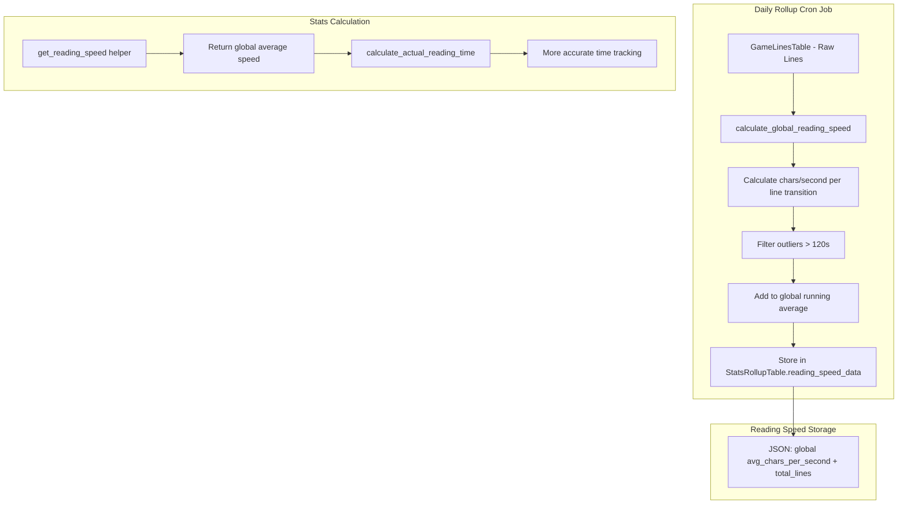

# Global Dynamic AFK Timer Plan

## Overview

Add a "reading speed" feature that calculates a **global average** reading speed (characters per second) across all games, storing this in the stats rollup system. This enables dynamic AFK timer thresholds based on the user's overall reading patterns.

## Problem Statement

Currently, the AFK timer uses a static threshold (120 seconds by default) for all games. This is not personalized to the user's actual reading behavior. By calculating a global average reading speed, we can:
- Determine more accurate AFK thresholds based on actual user behavior
- Simplify implementation without per-game complexity
- Provide a single, easy-to-understand metric

## Architecture



## Data Structure

### New Field in StatsRollupTable

```python
# Added to _fields list in stats_rollup_table.py
"reading_speed_data"  # JSON string

# Structure of the JSON - simple global average:
{
    "avg_chars_per_second": 14.2,
    "total_lines": 5000
}
```

### Minimum Lines Threshold

A simple global threshold of **100 lines** minimum before the calculated reading speed is used. Below this threshold, fall back to the default AFK timer setting.

## Calculation Algorithm

### Integrated in Daily Stats Rollup:

The reading speed calculation is integrated into the existing `calculate_daily_stats` function in `daily_rollup.py`.

1. During daily rollup, for all lines that day:
   - Get all lines sorted by timestamp
   - For each consecutive pair of lines:
     - `time_gap = line[i+1].timestamp - line[i].timestamp`
     - `char_count = len(line[i].line_text)`
     - If `time_gap <= 120` and `char_count > 0`:
       - `reading_speed = char_count / time_gap` (chars/second)
       - Add to samples
   - Calculate average of all valid samples
   - Store in `reading_speed_data` JSON field

### Aggregation Across Rollups:

When combining rollup data, use weighted average based on lines count:
```
combined_speed = sum(speed * lines) / sum(lines)
```

### Minimum Lines Threshold Check:

When using the global speed:
```python
if total_lines >= 100:
    use calculated_global_speed
else:
    use default_afk_timer_seconds
```

## Implementation Steps

### Phase 1: Schema Update
1. Add `reading_speed_data` field to `StatsRollupTable`
2. Update `_fields` and `_types` lists
3. Update constructor with default `{}`

### Phase 2: Calculation Function
1. Create `calculate_global_reading_speed` function in `daily_rollup.py`
2. Calculate global reading speed from all lines
3. Return JSON-serializable dictionary with `avg_chars_per_second` and `total_lines`

### Phase 3: Daily Rollup Integration
1. Call new function in `calculate_daily_stats`
2. Store result in rollup record
3. Update existing rollup entries on reprocessing

### Phase 4: Aggregation
1. Create helper function in `rollup_stats.py` to merge reading speed data
2. Use weighted average for combining across days
3. Provide easy access to global average speed

### Phase 5: Usage in Stats
1. Create `get_reading_speed` utility function
2. Modify `calculate_actual_reading_time` to use global reading speed
3. Update stats display to show global reading speed

## Files to Modify

| File | Changes |
|------|---------|
| `GameSentenceMiner/util/stats_rollup_table.py` | Add `reading_speed_data` field |
| `GameSentenceMiner/util/cron/daily_rollup.py` | Add `calculate_global_reading_speed` function, update `calculate_daily_stats` |
| `GameSentenceMiner/web/rollup_stats.py` | Add aggregation logic for reading speed |
| `GameSentenceMiner/web/stats.py` | Add helper function, update time calculation |

## Edge Cases

1. **No data yet**: Use default AFK timer setting
2. **Less than 100 lines total**: Use default AFK timer setting
3. **Only 1 line in a sequence**: Cannot calculate speed, skip
4. **Very short lines**: Include in calculation - reading time still matters
5. **Very long gaps > 120s**: Exclude from calculation - likely AFK
6. **Zero character lines**: Skip in calculation

## Stats Page Updates

### stats.html Changes Needed

The settings modal (lines 340-358) currently includes `afkTimerSeconds`. Updates needed:

1. **Display global reading speed** - Add a read-only display showing the calculated global reading speed (chars/second)
2. **No new settings required** - The reading speed is calculated automatically, not user-configurable

### stats.js Changes Needed

The settings population code (lines 2766-2789) handles `window.statsConfig`. Updates needed:

1. **Add reading speed display** - Around line 2789, add logic to display the global reading speed if available from `statsConfig`
2. **Format display** - Show the reading speed in a user-friendly format like "14.2 chars/sec"
3. **Conditional rendering** - Only show if `total_lines >= 100`, otherwise show "Calculating..." or similar

### Example stats.js Addition (after line 2789):
```javascript
// Display global reading speed if available
const readingSpeedDisplay = document.getElementById('globalReadingSpeed');
if (readingSpeedDisplay && window.statsConfig.readingSpeed) {
    if (window.statsConfig.readingSpeed.total_lines >= 100) {
        readingSpeedDisplay.textContent =
            window.statsConfig.readingSpeed.avg_chars_per_second.toFixed(1) + ' chars/sec';
    } else {
        readingSpeedDisplay.textContent = 'Calculating... (need more data)';
    }
}
```

### Example stats.html Addition (in settings or stats section):
```html
<div class="dashboard-stat-item tooltip" data-tooltip="Your calculated average reading speed">
    <span class="dashboard-stat-value" id="globalReadingSpeed">-</span>
    <span class="dashboard-stat-label">Reading Speed</span>
</div>
```

## Todo List

- [ ] Add `reading_speed_data` JSON field to StatsRollupTable schema
- [ ] Create `calculate_global_reading_speed` function in `daily_rollup.py` to calculate global chars/second
- [ ] Integrate reading speed calculation into existing `calculate_daily_stats` function
- [ ] Create helper function in `rollup_stats.py` to merge reading speed data across all rollups using weighted average
- [ ] Create `get_reading_speed` utility function that returns global speed if lines >= 100, otherwise returns default
- [ ] Modify `calculate_actual_reading_time` to use global reading speed
- [ ] Update `stats.py` to include reading speed data in API response
- [ ] Add reading speed display to stats.html dashboard
- [ ] Add reading speed population logic to stats.js
- [ ] Test reading speed calculation with sample data
