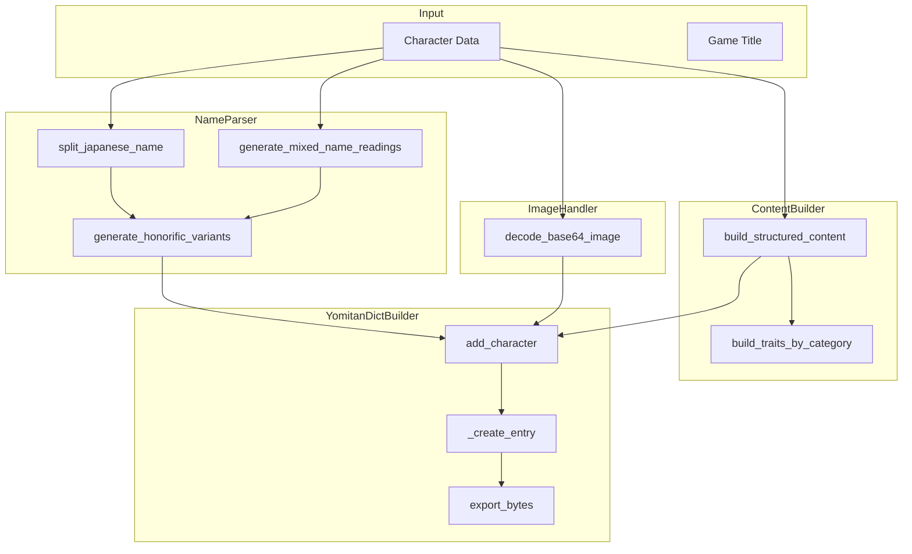

# Major Refactoring Plan

## Executive Summary

This document outlines a comprehensive refactoring plan for five key modules in the GameSentenceMiner project. The goal is to improve maintainability, reduce code duplication, and establish cleaner separation of concerns while maintaining backward compatibility.

---

## 1. Current State Analysis

### 1.1 YomitanDictBuilder (`yomitan_dict.py` - 1091 lines)

**Current Structure:**
A monolithic class handling all aspects of Yomitan dictionary generation:
- Image decoding and base64 handling
- Japanese name parsing and splitting
- Romanized name to hiragana conversion
- Structured content building for Yomitan format
- Spoiler filtering and markup parsing
- ZIP file export

**Key Issues:**
- Single class with 25+ methods handling multiple unrelated concerns
- Hardcoded honorific suffixes list (15 entries) embedded in class
- Complex name parsing logic spread across 6 methods
- Mixed responsibilities: data transformation, formatting, and I/O

### 1.2 AniListApiClient (`anilist_api_client.py` - 899 lines)

**Current Structure:**
A class providing AniList GraphQL API integration:
- GraphQL queries hardcoded as class constants
- Media search and character fetching
- Image downloading and thumbnail creation  
- Character data formatting for translation context

**Key Issues:**
- GraphQL queries embedded as multi-line strings (~70 lines)
- Image processing methods duplicate VNDB client
- Spoiler handling duplicates VNDB patterns
- Character formatting logic similar to VNDB

### 1.3 VNDBApiClient (`vndb_api_client.py` - 851 lines)

**Current Structure:**
A class providing VNDB REST API integration:
- VN search and character fetching
- Image downloading and thumbnail creation
- Character data formatting with spoiler filtering
- Translation context generation

**Key Issues:**
- Nearly identical image processing to AniList client
- Similar spoiler handling patterns
- Parallel character formatting structure
- Duplicated translation context creation

### 1.4 JitenUpgrader (`jiten_upgrader.py` - 426 lines)

**Current Structure:**
A cron module for auto-upgrading games to Jiten:
- Queries games with external IDs but no Jiten link
- Checks Jiten availability via API
- Updates game records and fetches character data

**Key Issues:**
- `add_jiten_link_to_game()` function duplicated in `jiten_database_api.py`
- `build_update_fields()` logic parallels API route logic
- `fetch_character_data_for_upgraded_game()` duplicates route logic
- Mixed concerns: orchestration, API calls, database updates

### 1.5 jiten_database_api.py (1742 lines)

**Current Structure:**
A single file containing all Jiten-related API routes:
- 13 route handlers
- Helper functions for game linking
- Unified search across multiple sources

**Key Issues:**
- All routes in one file (1742 lines)
- `api_link_game_to_jiten()` - ~270 lines
- `api_repull_game_from_jiten()` - ~320 lines  
- `api_unified_search()` - ~310 lines
- Duplicated error handling patterns
- `add_jiten_link_to_game()` duplicated from jiten_upgrader.py

---

## 2. YomitanDictBuilder Refactoring

### 2.1 Proposed Class Breakdown

```
yomitan_dict/
├── __init__.py              # Public exports
├── builder.py               # YomitanDictBuilder orchestrator
├── name_parser.py           # NameParser class
├── image_handler.py         # ImageHandler class
├── content_builder.py       # ContentBuilder class
├── constants.py             # Honorifics, role colors, etc.
└── models.py                # Data classes for entries
```

### 2.2 New Classes

#### NameParser
Responsible for all Japanese name splitting and reading generation.

```python
class NameParser:
    HONORIFIC_SUFFIXES = [...]  # Move from YomitanDictBuilder
    
    def split_japanese_name(name_original: str) -> NameParts
    def split_romanized_name_to_hiragana(romanized_name: str) -> ReadingParts
    def generate_kana_readings(name_original: str) -> ReadingParts
    def generate_mixed_name_readings(name_original: str, romanized_name: str) -> ReadingParts
    def contains_kanji(text: str) -> bool
    def generate_honorific_variants(base_name: str, base_reading: str) -> list[tuple]
```

#### ImageHandler
Responsible for image decoding and path management.

```python
class ImageHandler:
    def decode_base64_image(base64_data: str, char_id: str) -> tuple[str, bytes]
    def get_image_path(char_id: str, extension: str) -> str
    def detect_image_format(base64_header: str) -> str
```

#### ContentBuilder
Responsible for creating Yomitan structured content.

```python
class ContentBuilder:
    ROLE_COLORS = {...}   # Move from YomitanDictBuilder
    ROLE_LABELS = {...}
    SEX_DISPLAY = {...}
    
    def build_structured_content(char: dict, image_path: str, game_title: str, spoiler_level: int) -> dict
    def build_physical_stats_line(char: dict) -> str
    def build_traits_by_category(char: dict, spoiler_level: int) -> list
    def format_birthday(birthday) -> str
    def strip_spoiler_content(text: str) -> str
    def parse_vndb_markup(text: str) -> str
```

#### YomitanDictBuilder (Refactored)
Orchestrates the other classes and handles export.

```python
class YomitanDictBuilder:
    def __init__(self, ...)
    def add_character(char: dict, game_title: str) -> None
    def add_game_characters(game: GamesTable) -> int
    def export_bytes() -> bytes
    def export(output_path: str) -> str
    
    # Private orchestration
    def _create_entry(term, reading, role, score, content) -> list
    def _create_index() -> dict
    def _create_tag_bank() -> list
```

### 2.3 Data Flow Diagram



---

## 3. API Clients Refactoring (VNDB/AniList)

### 3.1 Common Patterns Identified

| Pattern | VNDBApiClient | AniListApiClient |
|---------|--------------|------------------|
| Image fetching | `fetch_image_as_base64()` | `fetch_image_as_base64()` |
| Cover download | `download_cover_image()` | `download_cover_image()` |
| Spoiler check | `has_spoiler_tags()` | `has_spoiler_tags()` |
| Spoiler strip | `strip_spoiler_content()` | `strip_spoiler_tags()` |
| Context creation | `create_translation_context()` | `create_translation_context()` |
| Thumbnail size | `THUMBNAIL_SIZE = (80, 100)` | `THUMBNAIL_SIZE = (80, 100)` |
| Cover size | `COVER_IMAGE_SIZE = (300, 400)` | `COVER_IMAGE_SIZE = (300, 400)` |
| Timeout | `TIMEOUT = 10` | `TIMEOUT = 15` |

### 3.2 Proposed Structure

```
api_clients/
├── __init__.py              # Public exports
├── base_client.py           # BaseApiClient abstract class
├── image_utils.py           # Shared image processing
├── spoiler_utils.py         # Shared spoiler handling
├── vndb_client.py           # VNDBApiClient
├── anilist_client.py        # AniListApiClient
└── anilist_queries.py       # GraphQL query strings
```

### 3.3 Base Class Structure

```python
class BaseApiClient(ABC):
    TIMEOUT: int = 10
    THUMBNAIL_SIZE: tuple = (80, 100)
    COVER_IMAGE_SIZE: tuple = (300, 400)
    
    @classmethod
    def fetch_image_as_base64(cls, image_url: str, size: tuple = None) -> Optional[str]:
        # Shared implementation
        
    @classmethod  
    def download_cover_image(cls, ...) -> Optional[str]:
        # Template method - calls _get_cover_url()
        
    @abstractmethod
    def _get_cover_url(cls, identifier) -> Optional[str]:
        # Implemented by subclasses
        
    @staticmethod
    def create_translation_context(data: Dict) -> str:
        # Shared implementation with role_labels parameter
```

### 3.4 Shared Utilities

```python
# image_utils.py
def fetch_and_resize_image(url: str, size: tuple, timeout: int) -> Optional[bytes]:
    # Common image fetching and resizing logic
    
def encode_image_as_base64(image_bytes: bytes, format: str) -> str:
    # Common base64 encoding with data URI prefix

# spoiler_utils.py  
def strip_vndb_spoilers(text: str) -> str:
    # [spoiler]...[/spoiler] handling
    
def strip_anilist_spoilers(text: str) -> str:
    # ~!...!~ handling
    
def has_spoiler_tags(text: str, format: str = 'auto') -> bool:
    # Unified spoiler detection
```

### 3.5 What Remains Specific to Each Client

**VNDBApiClient:**
- REST API payload construction
- `normalize_vndb_id()` - v prefix handling
- `categorize_traits()` / `categorize_traits_with_spoilers()`
- `get_character_role()` - VN-specific role extraction
- Trait group handling (Personality, Role, etc.)

**AniListApiClient:**
- GraphQL query execution
- `extract_media_id()` / `get_media_type()` from URL
- Role mapping (MAIN→main, SUPPORTING→primary, BACKGROUND→side)
- GraphQL error handling

---

## 4. JitenUpgrader Improvements

### 4.1 Current Jiten Data Handling

**Verified Workflow:**
1. ✅ Queries games with `vndb_id` or `anilist_id` but no `deck_id`
2. ✅ Calls `JitenApiClient.get_deck_by_link_id()` to check Jiten availability
3. ✅ Fetches full deck detail via `JitenApiClient.get_deck_detail()`
4. ✅ Normalizes data via `JitenApiClient.normalize_deck_data()`
5. ✅ Downloads cover image via `JitenApiClient.download_cover_image()`
6. ✅ Updates game record with Jiten metadata
7. ✅ Fetches character data from VNDB/AniList based on media type

### 4.2 Proposed Improvements

#### 4.2.1 Extract Shared Game Update Service

Create a new module to share logic between jiten_upgrader.py and jiten_database_api.py:

```python
# game_update_service.py
class GameUpdateService:
    @staticmethod
    def build_update_fields_from_jiten(game: GamesTable, jiten_data: Dict) -> Dict:
        # Shared field mapping logic
        
    @staticmethod
    def add_jiten_link_to_game(game: GamesTable, deck_id: int) -> None:
        # Single implementation
        
    @staticmethod
    def fetch_character_data(game: GamesTable, media_type: str, links: list) -> bool:
        # Unified VNDB/AniList character fetching
```

#### 4.2.2 Improved Error Handling

```python
class JitenUpgradeResult:
    game_id: str
    name: str
    upgraded: bool
    deck_id: Optional[int]
    source: Optional[str]  # 'vndb' or 'anilist'
    error: Optional[str]
    updated_fields: list[str]
```

#### 4.2.3 Rate Limiting Enhancement

```python
class RateLimiter:
    def __init__(self, requests_per_minute: int = 60):
        self.delay = 60.0 / requests_per_minute
        
    def wait(self):
        time.sleep(self.delay)
```

---

## 5. jiten_database_api.py Route Split

### 5.1 Proposed File Organization

```
web/routes/
├── __init__.py                    # Route registration
├── game_management_routes.py      # CRUD operations
├── jiten_linking_routes.py        # Jiten linking/unlinking
├── search_routes.py               # Unified search
├── cron_routes.py                 # Cron job triggers
└── debug_routes.py                # Debug endpoints
```

### 5.2 Route Distribution

#### game_management_routes.py (~400 lines)
- `GET /api/games-management` - List all games
- `PUT /api/games/<game_id>` - Update game manually
- `POST /api/games/<game_id>/mark-complete` - Mark complete
- `DELETE /api/games/<game_id>` - Unlink game
- `DELETE /api/games/<game_id>/delete-lines` - Delete game lines
- `GET /api/orphaned-games` - Get orphaned game names
- `POST /api/games` - Create new game

#### jiten_linking_routes.py (~500 lines)
- `GET /api/jiten-search` - Search Jiten.moe
- `POST /api/games/<game_id>/link-jiten` - Link to Jiten
- `POST /api/games/<game_id>/repull-jiten` - Repull from all sources

#### search_routes.py (~400 lines)
- `GET /api/search/unified` - Unified search across sources

#### cron_routes.py (~100 lines)
- `POST /api/cron/jiten-upgrader/run` - Manual trigger

#### debug_routes.py (~100 lines)
- `GET /api/debug-db` - Database debug info

### 5.3 Shared Utilities to Extract

```python
# web/utils/game_linker.py
def add_jiten_link_to_game(game, deck_id):
    # Shared implementation
    
def update_game_from_source_data(game, source_data, source_name, manual_overrides):
    # Generic field update logic
    
def link_game_lines_to_game(game_id, obs_scene_name):
    # Game lines linking logic
```

### 5.4 Route Registration Pattern

```python
# web/routes/__init__.py
def register_all_routes(app):
    from .game_management_routes import register_game_management_routes
    from .jiten_linking_routes import register_jiten_linking_routes
    from .search_routes import register_search_routes
    from .cron_routes import register_cron_routes
    from .debug_routes import register_debug_routes
    
    register_game_management_routes(app)
    register_jiten_linking_routes(app)
    register_search_routes(app)
    register_cron_routes(app)
    register_debug_routes(app)
```

---

## 6. Implementation Order

The recommended sequence for implementing these changes:

### Phase 1: Foundation - Shared Utilities
1. Create `GameSentenceMiner/util/image_utils.py` with shared image processing
2. Create `GameSentenceMiner/util/spoiler_utils.py` with unified spoiler handling
3. Create `GameSentenceMiner/web/utils/game_linker.py` with shared link management

### Phase 2: API Clients Refactoring
4. Create `GameSentenceMiner/util/api_clients/base_client.py` with BaseApiClient
5. Refactor VNDBApiClient to extend BaseApiClient
6. Refactor AniListApiClient to extend BaseApiClient
7. Extract GraphQL queries to separate file

### Phase 3: JitenUpgrader Improvements
8. Create `GameSentenceMiner/util/game_update_service.py`
9. Refactor jiten_upgrader.py to use GameUpdateService
10. Update jiten_database_api.py to use GameUpdateService

### Phase 4: YomitanDictBuilder Refactoring
11. Create `GameSentenceMiner/util/yomitan_dict/` package structure
12. Extract NameParser class
13. Extract ImageHandler class
14. Extract ContentBuilder class
15. Create Constants module
16. Refactor YomitanDictBuilder to orchestrate new classes

### Phase 5: Route Split
17. Create `GameSentenceMiner/web/routes/` directory structure
18. Extract game_management_routes.py
19. Extract jiten_linking_routes.py
20. Extract search_routes.py
21. Extract cron_routes.py and debug_routes.py
22. Update main app.py to use route registration

### Phase 6: Cleanup and Testing
23. Update all imports across the codebase
24. Remove deprecated duplicate functions
25. Add/update unit tests for new modules

---

## 7. Backward Compatibility Considerations

### Import Compatibility
Maintain re-exports in original module locations:

```python
# GameSentenceMiner/util/yomitan_dict.py (legacy)
from GameSentenceMiner.util.yomitan_dict.builder import YomitanDictBuilder

# GameSentenceMiner/util/vndb_api_client.py (legacy) 
from GameSentenceMiner.util.api_clients.vndb_client import VNDBApiClient
```

### API Contract Preservation
- All public methods maintain their signatures
- Return types remain unchanged
- Existing callers continue to work without modification

### Database Schema
- No database changes required
- All field mappings preserved

---

## 8. Risk Assessment

| Risk | Impact | Mitigation |
|------|--------|------------|
| Breaking existing imports | High | Maintain re-exports in original locations |
| Subtle behavior changes | Medium | Comprehensive testing before/after |
| Circular imports | Medium | Careful dependency ordering |
| Performance regression | Low | Profile before/after refactoring |

---

## 9. Success Metrics

After refactoring:
- No single file exceeds 500 lines
- No class exceeds 300 lines
- Code duplication reduced by 40%+
- All existing tests pass
- No breaking changes to public APIs
