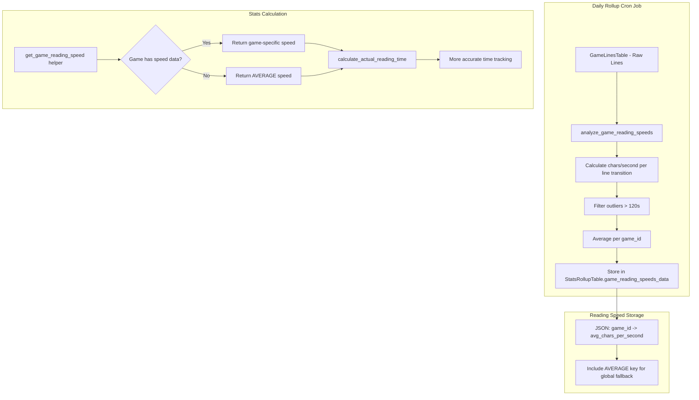

# Per-Game Reading Speed Feature Plan

## Overview

Add a "reading speed" feature that calculates the average reading speed (characters per second) for each game, storing this in the stats rollup system. This enables dynamic AFK timer thresholds based on game-specific reading patterns.

## Problem Statement

Currently, the AFK timer uses a global threshold (120 seconds by default) for all games. However, different games have different text densities:
- Visual novels with long paragraphs → users take longer per line
- Games with short dialogue → users advance quickly

A per-game reading speed allows for more accurate time tracking by using game-specific thresholds.

## Architecture



## Data Structure

### New Field in StatsRollupTable

```python
# Added to _fields list in stats_rollup_table.py
"game_reading_speeds_data"  # JSON string

# Structure of the JSON:
{
    "game_uuid_1": {
        "avg_chars_per_second": 15.5,
        "sample_count": 234,
        "title": "Game Title"
    },
    "game_uuid_2": {
        "avg_chars_per_second": 12.3,
        "sample_count": 567,
        "title": "Another Game"
    },
    "AVERAGE": {
        "avg_chars_per_second": 14.2,
        "total_sample_count": 801
    }
}
```

## Calculation Algorithm

### For Each Game on Each Day:

1. Get all lines for the game, sorted by timestamp
2. For each consecutive pair of lines:
   - `time_gap = line[i+1].timestamp - line[i].timestamp`
   - `char_count = len(line[i].line_text)`
   - If `time_gap <= 120` and `char_count > 0`:
     - `reading_speed = char_count / time_gap` (chars/second)
     - Add to samples
3. Calculate average of all valid samples
4. Store result

### Aggregation Across Rollups:

When combining rollup data, use weighted average based on sample_count:
```
combined_speed = sum(speed * count) / sum(count)
```

## Implementation Steps

### Phase 1: Schema Update
1. Add `game_reading_speeds_data` field to `StatsRollupTable`
2. Update `_fields` and `_types` lists
3. Update constructor with default `{}`

### Phase 2: Calculation Function
1. Create `analyze_game_reading_speeds` function in `daily_rollup.py`
2. Calculate per-game reading speeds from lines
3. Calculate global AVERAGE across all games
4. Return JSON-serializable dictionary

### Phase 3: Daily Rollup Integration
1. Call new function in `calculate_daily_stats`
2. Store result in rollup record
3. Update existing rollup entries on reprocessing

### Phase 4: Aggregation
1. Create helper function in `rollup_stats.py` to merge reading speeds
2. Use weighted average for combining across days
3. Provide easy access to game-specific or average speed

### Phase 5: Usage in Stats
1. Create `get_game_reading_speed` utility function
2. Optionally modify `calculate_actual_reading_time` to accept per-game speeds
3. Update stats display to show reading speed per game

## Files to Modify

| File | Changes |
|------|---------|
| `GameSentenceMiner/util/stats_rollup_table.py` | Add `game_reading_speeds_data` field |
| `GameSentenceMiner/util/cron/daily_rollup.py` | Add `analyze_game_reading_speeds` function, update `calculate_daily_stats` |
| `GameSentenceMiner/web/rollup_stats.py` | Add aggregation logic for reading speeds |
| `GameSentenceMiner/web/stats.py` | Add helper function, optionally update time calculation |

## Edge Cases

1. **New game with no data**: Use global AVERAGE
2. **Game with only 1 line**: Cannot calculate speed, skip
3. **Very short lines**: Include in calculation (reading time still matters)
4. **Very long gaps > 120s**: Exclude from calculation (AFK)
5. **Zero character lines**: Skip in calculation

## Testing

1. Create test data with known reading patterns
2. Verify per-game speed calculations are accurate
3. Verify aggregation produces correct weighted averages
4. Verify fallback to AVERAGE works for unknown games
