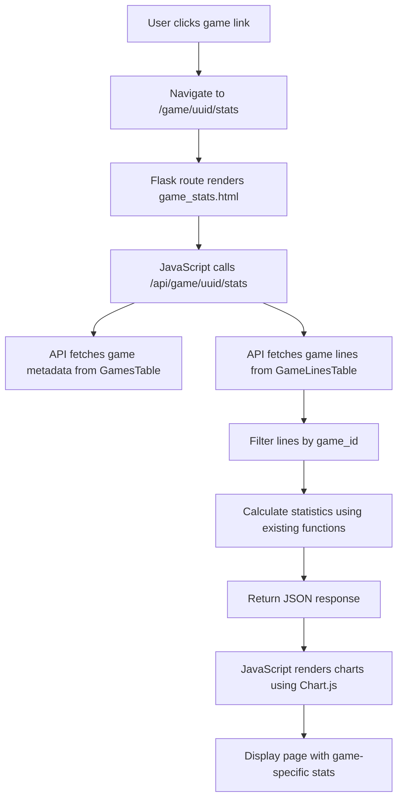

# Per-Game Statistics Page - Design Document

## Overview

Create a dedicated statistics page for individual games, accessible via a URL like `/game/<game_id>/stats`. This page will display game-specific statistics similar to the main stats page but filtered for a single game.

**Note:** The per-game stats page will show ALL-TIME statistics for the game (no date range filtering). This simplifies the UI and provides a comprehensive view of the player's progress with that specific game.

---

## URL Structure

**Recommended:** `/game/<game_id>/stats`

**Alternative:** `/stats/game/<game_id>`

The `game_id` is a UUID stored in the games table (`GamesTable.id` field).

**Example URLs:**
- `/game/a1b2c3d4-e5f6-7890-abcd-ef1234567890/stats`

---

## Route Definition (texthooking_page.py)

Add new route:

```python
@app.route("/game/<game_id>/stats")
def game_stats(game_id):
    """Renders the per-game stats page."""
    from GameSentenceMiner.util.configuration import get_master_config, get_stats_config
    from GameSentenceMiner.util.games_table import GamesTable
    
    # Fetch game metadata
    game = GamesTable.get(game_id)
    if not game:
        return "Game not found", 404
    
    return render_template(
        "game_stats.html",
        game=game,
        game_id=game_id,
        config=get_config(),
        master_config=get_master_config(),
        stats_config=get_stats_config(),
    )
```

---

## API Endpoint (stats_api.py)

Add new endpoint: `/api/game/<game_id>/stats`

This endpoint will return game-specific statistics by filtering all calculations to only include lines where `game_id` matches the requested game.

### Response Structure

```json
{
    "gameMetadata": {
        "id": "uuid",
        "title_original": "...",
        "title_romaji": "...",
        "title_english": "...",
        "type": "...",
        "description": "...",
        "image": "base64...",
        "character_count": 12345,
        "difficulty": 3,
        "links": [],
        "completed": false,
        "release_date": "2020-01-01",
        "genres": [],
        "tags": []
    },
    "totalStats": {
        "total_characters": 50000,
        "total_time_hours": 25.5,
        "reading_speed": 2000,
        "sessions": 15,
        "progress_percentage": 45.2,
        "first_date": "2024-01-01",
        "last_date": "2024-12-25"
    },
    "peakStats": {
        "max_daily_chars": 5000,
        "max_daily_hours": 3.5,
        "longest_session_hours": 2.5,
        "max_session_chars": 4000
    },
    "dailyActivity": {
        "labels": ["2024-12-01", "2024-12-02"],
        "timeData": [1.5, 2.0],
        "charsData": [3000, 4000],
        "speedData": [2000, 2100]
    },
    "cumulativeData": {
        "labels": ["2024-12-01", "2024-12-02"],
        "chars": [3000, 7000],
        "lines": [50, 120]
    },
    "hourlyActivity": [0, 0, 100, 500],
    "hourlySpeed": [0, 0, 1500, 2000],
    "dayOfWeek": {
        "chars": [5000, 6000, 4000, 5500, 3000, 8000, 7000],
        "hours": [2.5, 3.0, 2.0, 2.75, 1.5, 4.0, 3.5],
        "avg_hours": [2.5, 3.0, 2.0, 2.75, 1.5, 4.0, 3.5]
    },
    "topDays": {
        "speed": [
            {"date": "2024-12-15", "speed": 3500},
            {"date": "2024-12-10", "speed": 3200}
        ],
        "chars": [
            {"date": "2024-12-15", "chars": 5000},
            {"date": "2024-12-20", "chars": 4800}
        ]
    },
    "miningHeatmap": {
        "2024": {
            "2024-12-01": 5,
            "2024-12-02": 3
        }
    },
    "kanjiGrid": {
        "kanji_data": [
            {"kanji": "日", "frequency": 150, "color": "#2ee6e0"},
            {"kanji": "本", "frequency": 120, "color": "#3be62f"}
        ],
        "unique_count": 500,
        "max_frequency": 150
    },
    "cardsMinedLast30Days": {
        "labels": ["2024-12-01"],
        "totals": [3, 5]
    }
}
```

---

## HTML Template (game_stats.html)

Create new template at: `GameSentenceMiner/web/templates/game_stats.html`

### Structure

1. **Game Header Section** - Image, title, description, links, genres, tags
2. **Stats Summary Cards** - Total chars, time, speed, sessions, progress
3. **Daily Activity Charts** - Time, chars, speed (same as main stats)
4. **Cumulative Progress Chart** - Characters/lines over time
5. **Hourly Activity Pattern** - Activity by hour of day
6. **Day of Week Activity** - Activity by weekday
7. **Top Performance Days** - Best reading days
8. **Mining Activity** - Mining heatmap for this game
9. **Kanji Grid** - Kanji frequency for this game

### Jinja2 Components to Include

```jinja2





```

---

## JavaScript (game_stats.js)

Create new file at: `GameSentenceMiner/web/static/js/game_stats.js`

### Functions to Implement

| Function | Description |
|----------|-------------|
| `loadGameStats(gameId)` | Fetch data from `/api/game/<game_id>/stats` |
| `renderGameMetadata(data)` | Display game info header |
| `createDailyCharts(data)` | Daily time/chars/speed charts |
| `createCumulativeChart(data)` | Cumulative progress chart |
| `createHourlyCharts(data)` | Hourly activity and speed charts |
| `createDayOfWeekChart(data)` | Day of week activity |
| `createTopDaysCharts(data)` | Top 5 performance days |
| `createMiningHeatmap(data)` | Mining activity heatmap |
| `createKanjiGrid(data)` | Kanji frequency grid |

Reuse existing chart functions from `stats.js` where possible.

---

## CSS Styling

Reuse existing CSS from:
- `stats.css` - Chart containers, dashboard cards
- `overview.css` - Game metadata display (photo, titles, description)
- `shared.css` - Common components

May need minor additions for game-specific header styling.

---

## Backend Calculations (stats.py modifications)

Most calculation functions already accept filtered line lists. Need to ensure all functions work correctly with game-filtered data.

### Key Functions to Verify/Modify

- `calculate_heatmap_data(all_lines, filter_year)`
- `calculate_mining_heatmap_data(all_lines, filter_year)`
- `calculate_kanji_frequency(all_lines)`
- `calculate_peak_daily_stats(all_lines)`
- `calculate_peak_session_stats(all_lines)`
- `calculate_hourly_activity(all_lines)`
- `calculate_hourly_reading_speed(all_lines)`
- `calculate_daily_reading_time(lines)`

All these already work with filtered line lists - just need to pass game-filtered lines from the API endpoint.

---

## Database Queries

To get all lines for a specific game:

**Option 1: Using game_id parameter (preferred)**
```python
GameLinesTable.get_lines_filtered_by_timestamp(
    start=start_timestamp,
    end=end_timestamp,
    game_id=game_id
)
```

**Option 2: Filter in Python**
```python
all_lines = GameLinesTable.get_lines_filtered_by_timestamp(...)
game_lines = [line for line in all_lines if line.game_id == game_id]
```

Need to add `game_id` parameter to `get_lines_filtered_by_timestamp()` method.

---

## Navigation Links

Add links to per-game stats from:

1. **Database Management page** - Add "Stats" button next to each game
2. **Overview page** - Make current game title clickable
3. **Main stats page** - Make game names in charts clickable

---

## Architecture Diagram



---

## Implementation Order

1. Add `game_id` filter to `GameLinesTable.get_lines_filtered_by_timestamp()`
2. Create `/api/game/<game_id>/stats` endpoint in `stats_api.py`
3. Create `game_stats.html` template
4. Create `game_stats.js` with chart rendering functions
5. Add route in `texthooking_page.py`
6. Add navigation links from other pages
7. Test with existing game data

---

## Future Enhancements

- Compare stats between games (side-by-side view)
- Export game stats as PDF/image
- Share game stats publicly (read-only URL)
- Historical snapshots of progress
