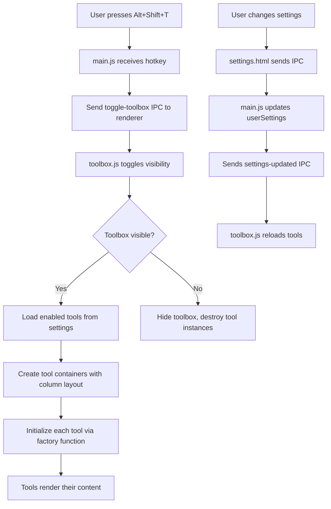
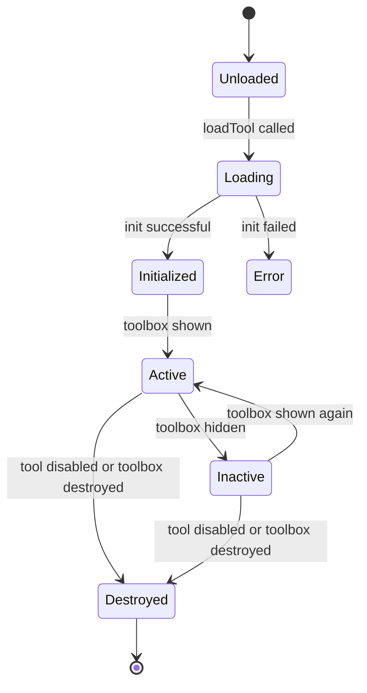
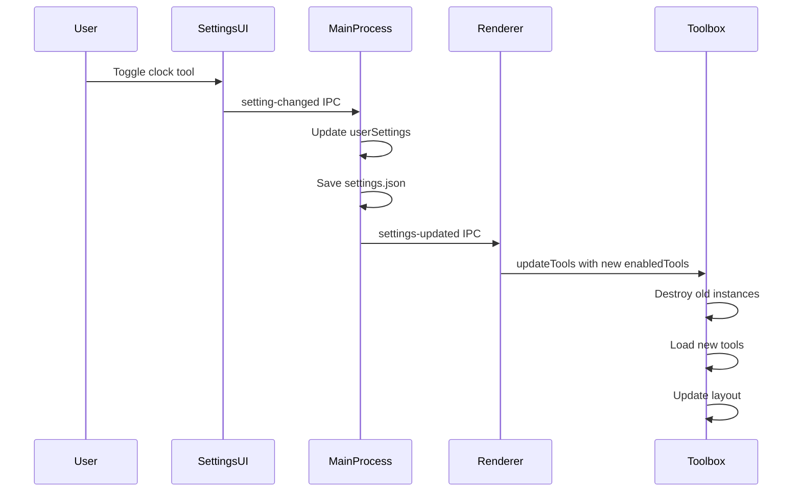

# GSM Overlay - Toolbox System Implementation Plan

## Overview

This plan details the implementation of a modular Toolbox system for GSM_Overlay. The Toolbox provides a transparent, full-screen overlay with small utility tools (starting with a 24-hour clock) that assist users while playing games.

## Architecture Analysis

### Current System Integration Points

1. **Main Process** ([`main.js`](../GSM_Overlay/main.js))
   - Hotkey registration using `globalShortcut.register()`
   - Settings management (`userSettings` object, saved to AppData)
   - IPC handlers for renderer communication
   - Window management and visibility control

2. **Renderer Process** ([`index.html`](../GSM_Overlay/index.html))
   - Inline styles and scripts (must keep toolbox separate)
   - Interactive element handling
   - IPC communication with main process

3. **Settings Window** ([`settings.html`](../GSM_Overlay/settings.html))
   - Grid-based layout with setting groups
   - Checkbox and input controls
   - IPC-based settings updates

4. **Settings Storage**
   - Windows: `%APPDATA%/gsm_overlay/settings.json`
   - macOS/Linux: `~/.config/gsm_overlay/settings.json`
   - Platform-specific handling already in place

## Proposed File Structure

```
GSM_Overlay/
├── toolbox/
│   ├── toolbox.js              # Main toolbox manager (loaded by index.html)
│   ├── toolbox.css             # Toolbox-specific styles
│   ├── tool-registry.js        # Tool registration and discovery
│   ├── tools/
│   │   ├── clock/
│   │   │   ├── clock.js        # Clock tool implementation
│   │   │   └── clock.css       # Clock-specific styles
│   │   └── _template/
│   │       ├── template.js     # Template for new tools
│   │       └── template.css    # Template styles
│   └── README.md               # Toolbox developer documentation
├── index.html                   # Modified to include toolbox container + script
├── main.js                      # Modified to add toolbox hotkey
├── settings.html                # Modified to add Toolbox settings section
└── toolbox.md                   # User-facing documentation (as required)
```

## Component Design

### 1. Toolbox Manager (`toolbox/toolbox.js`)

**Responsibilities:**
- Initialize and manage the toolbox overlay container
- Load enabled tools from settings
- Calculate and apply column-based layout (100/N % width)
- Handle toolbox visibility state
- Communicate with main process via IPC
- Ignore Alt+Shift+H "hide box" hotkey when active

**Key Functions:**
```javascript
class ToolboxManager {
  constructor() {
    this.container = null;
    this.tools = new Map();
    this.visible = false;
    this.enabled = false;
  }
  
  init() // Initialize toolbox container in DOM
  toggle() // Show/hide toolbox
  loadTools(enabledToolIds) // Load enabled tools
  updateLayout() // Recalculate column widths
  destroy() // Cleanup
}
```

**DOM Structure:**
```html
<div id="toolbox-overlay" style="display: none;">
  <!-- Tools dynamically inserted as columns -->
  <div class="toolbox-column" data-tool-id="clock">
    <!-- Clock tool content -->
  </div>
</div>
```

### 2. Tool Registry (`toolbox/tool-registry.js`)

**Responsibilities:**
- Maintain catalog of available tools
- Provide tool metadata (id, name, hasSettings)
- Load tool modules dynamically

**Tool Manifest Structure:**
```javascript
const TOOL_MANIFEST = {
  'clock': {
    id: 'clock',
    name: '24-Hour Clock',
    path: './tools/clock/clock.js',
    hasSettings: false,
    enabled: false // Default state
  }
};
```

### 3. Tool Interface (`toolbox/tools/_template/template.js`)

**Each tool must implement:**
```javascript
class ToolTemplate {
  constructor(container) {
    this.container = container; // DOM element for this tool
    this.settings = {};
  }
  
  // Required methods
  async init() // Initialize tool, create DOM elements
  destroy() // Cleanup, remove event listeners
  updateSettings(settings) // Apply new settings
  
  // Optional methods
  onShow() // Called when toolbox becomes visible
  onHide() // Called when toolbox becomes hidden
}

// Export factory function
window.createToolInstance = (container, settings) => {
  return new ToolTemplate(container);
};
```

### 4. Clock Tool (`toolbox/tools/clock/clock.js`)

**Implementation:**
```javascript
class ClockTool {
  constructor(container) {
    this.container = container;
    this.timeElement = null;
    this.intervalId = null;
  }
  
  async init() {
    this.timeElement = document.createElement('div');
    this.timeElement.className = 'clock-display';
    this.container.appendChild(this.timeElement);
    this.updateTime();
    this.intervalId = setInterval(() => this.updateTime(), 1000);
  }
  
  updateTime() {
    const now = new Date();
    const hours = String(now.getHours()).padStart(2, '0');
    const minutes = String(now.getMinutes()).padStart(2, '0');
    const seconds = String(now.getSeconds()).padStart(2, '0');
    this.timeElement.textContent = `${hours}:${minutes}:${seconds}`;
  }
  
  destroy() {
    if (this.intervalId) {
      clearInterval(this.intervalId);
    }
    if (this.timeElement) {
      this.timeElement.remove();
    }
  }
}

window.createClockTool = (container) => new ClockTool(container);
```

## Settings Integration

### 1. Add to `userSettings` in [`main.js`](../GSM_Overlay/main.js)

```javascript
let userSettings = {
  // ... existing settings
  "toggleToolboxHotkey": "Alt+Shift+T",
  "toolboxEnabled": false, // Master toggle
  "enabledTools": [], // Array of tool IDs, e.g., ['clock']
};
```

### 2. Add Toolbox Section to [`settings.html`](../GSM_Overlay/settings.html)

```html
<div class="setting-group">
  <h4>Toolbox</h4>
  <label>
    <span class="label-text">
      Enable Toolbox System
      <div class="hotkey-info">Provides utility tools overlay (clock, etc.)</div>
    </span>
    <input type="checkbox" id="toolboxEnabled" />
  </label>
  
  <label>
    <span class="label-text">
      Toggle Toolbox Hotkey
      <div class="hotkey-info">Show/hide toolbox overlay</div>
      <div class="hotkey-info" style="color: #4CAF50; font-size: 10px;">
        Click input and press your desired key (modifiers optional)
      </div>
    </span>
    <div class="input-container">
      <input type="text" id="toggleToolboxHotkey" value="Alt+Shift+T" />
      <button type="button" class="guide-button"
        onclick="window.open('https://www.electronjs.org/docs/latest/tutorial/keyboard-shortcuts', '_blank')">
        Guide
      </button>
    </div>
  </label>
  
  <!-- Tools List -->
  <div id="toolbox-tools-list">
    <h4 style="margin-top: 16px;">Available Tools</h4>
    <label>
      <span class="label-text">24-Hour Clock</span>
      <input type="checkbox" class="tool-checkbox" data-tool-id="clock" />
    </label>
    <!-- Future tools added here dynamically or statically -->
  </div>
</div>
```

### 3. Settings Event Handlers in [`settings.html`](../GSM_Overlay/settings.html)

```javascript
// Toolbox enabled toggle
document.getElementById("toolboxEnabled").addEventListener("change", (event) => {
  handleSettingChange("toolboxEnabled", event.target.checked);
});

// Toolbox hotkey
initializeHotkeyInput("toggleToolboxHotkey", {
  warningElementId: "toolbox-ctrl-warning",
  showCtrlWarning: true,
  placeholder: "Press keys...",
  settingKey: "toggleToolboxHotkey"
});

// Tool checkboxes
document.querySelectorAll('.tool-checkbox').forEach(checkbox => {
  checkbox.addEventListener('change', (event) => {
    updateEnabledTools();
  });
});

function updateEnabledTools() {
  const enabledTools = Array.from(document.querySelectorAll('.tool-checkbox:checked'))
    .map(cb => cb.dataset.toolId);
  handleSettingChange("enabledTools", enabledTools);
}
```

## IPC Communication Flow

### Main Process → Renderer

**New IPC Channels:**
- `toggle-toolbox`: Toggle toolbox visibility (from hotkey)
- `toolbox-settings-updated`: Notify renderer of settings changes

### Renderer → Main

**New IPC Channels:**
- `toolbox-visibility-changed`: Notify main process of visibility state

## Implementation Workflow



## Detailed Implementation Steps

### Phase 1: Core Toolbox Infrastructure

#### Step 1.1: Create Toolbox Manager
- **File**: `GSM_Overlay/toolbox/toolbox.js`
- **Actions**:
  - Create ToolboxManager class
  - Implement container creation and visibility toggle
  - Implement column layout calculator
  - Add IPC listeners for settings updates
  - Handle Alt+Shift+H exception (toolbox stays visible)

#### Step 1.2: Create Toolbox Styles
- **File**: `GSM_Overlay/toolbox/toolbox.css`
- **Actions**:
  - Define `#toolbox-overlay` container styles (full screen, transparent)
  - Define `.toolbox-column` styles (flex-based columns)
  - Ensure z-index doesn't interfere with existing overlays

#### Step 1.3: Create Tool Registry
- **File**: `GSM_Overlay/toolbox/tool-registry.js`
- **Actions**:
  - Define TOOL_MANIFEST constant
  - Implement loadTool() function to dynamically import tools
  - Implement getAllTools() for settings UI
  - Add validation for tool structure

### Phase 2: Main Process Integration

#### Step 2.1: Update Settings Schema
- **File**: `GSM_Overlay/main.js`
- **Location**: `userSettings` object (lines 41-66)
- **Actions**:
  - Add `toggleToolboxHotkey: "Alt+Shift+T"`
  - Add `toolboxEnabled: false`
  - Add `enabledTools: []`

#### Step 2.2: Register Toolbox Hotkey
- **File**: `GSM_Overlay/main.js`
- **Location**: After existing hotkey registrations (around line 951)
- **Actions**:
  - Create `registerToggleToolboxHotkey(oldHotkey)` function
  - Register hotkey handler to send `toggle-toolbox` IPC
  - Call registration in app.whenReady()

#### Step 2.3: Add IPC Handlers
- **File**: `GSM_Overlay/main.js`
- **Location**: With other IPC handlers (around line 1382)
- **Actions**:
  - Handle `toolbox-visibility-changed` from renderer
  - Forward settings updates to renderer for toolbox

### Phase 3: Renderer Integration

#### Step 3.1: Modify index.html
- **File**: `GSM_Overlay/index.html`
- **Location**: In `<head>` section
- **Actions**:
  - Add `<link rel="stylesheet" href="toolbox/toolbox.css">`
  
- **Location**: End of `<body>`, before closing tag (after line 570)
- **Actions**:
  - Add `<div id="toolbox-overlay"></div>` container
  - Add `<script src="toolbox/toolbox.js"></script>` (after existing scripts)

#### Step 3.2: Add IPC Listeners
- **File**: `GSM_Overlay/index.html`
- **Location**: In existing script section (after line 2251)
- **Actions**:
  - Add listener for `toggle-toolbox` IPC
  - Add listener for `load-settings` to initialize toolbox state
  - Handle toolbox visibility exceptions (ignore hide hotkey)

### Phase 4: Settings UI Integration

#### Step 4.1: Add Toolbox Settings Section
- **File**: `GSM_Overlay/settings.html`
- **Location**: In `.settings-grid` after existing groups (around line 469)
- **Actions**:
  - Add Toolbox setting group with master toggle
  - Add toolbox hotkey input with capture
  - Add tools list with checkboxes (initially just clock)

#### Step 4.2: Add Settings Event Handlers
- **File**: `GSM_Overlay/settings.html`
- **Location**: In script section (after line 778)
- **Actions**:
  - Add toolboxEnabled change handler
  - Add toggleToolboxHotkey capture
  - Add tool checkbox handlers
  - Preload toolbox settings from main process

### Phase 5: Clock Tool Implementation

#### Step 5.1: Create Clock Tool
- **File**: `GSM_Overlay/toolbox/tools/clock/clock.js`
- **Actions**:
  - Implement ClockTool class
  - Create time display element
  - Update every second using setInterval
  - Clean up on destroy

#### Step 5.2: Create Clock Styles
- **File**: `GSM_Overlay/toolbox/tools/clock/clock.css`
- **Actions**:
  - Center clock display vertically and horizontally
  - Large, readable font (responsive to column width)
  - Transparent background, white text with shadow

#### Step 5.3: Register Clock in Manifest
- **File**: `GSM_Overlay/toolbox/tool-registry.js`
- **Actions**:
  - Add clock entry to TOOL_MANIFEST
  - Map clock ID to file path

### Phase 6: Documentation

#### Step 6.1: Create Developer Documentation
- **File**: `GSM_Overlay/toolbox.md`
- **Content**:
  - Toolbox system overview
  - How to create a new tool (step-by-step guide)
  - Required file structure
  - Tool interface/API specification
  - Registration process
  - Settings integration guide
  - Clock tool as reference example
  - Best practices and gotchas

## Detailed Component Specifications

### Toolbox Container Styling

```css
#toolbox-overlay {
  position: fixed;
  top: 0;
  left: 0;
  width: 100vw;
  height: 100vh;
  display: none;
  pointer-events: none; /* Click-through by default */
  z-index: 9000; /* Below main UI elements but above game */
}

#toolbox-overlay.visible {
  display: flex;
  flex-direction: row;
}

.toolbox-column {
  height: 100%;
  display: flex;
  align-items: center;
  justify-content: center;
  pointer-events: auto; /* Tools can capture clicks if needed */
}
```

### Tool Lifecycle States



### Settings Update Flow



### Visibility Exception Handling

The specification requires that the Toolbox must remain visible even when Alt+Shift+H is pressed. This requires modifying the existing hide logic:

**Current Logic** ([`index.html`](../GSM_Overlay/index.html:2158)):
```javascript
ipcRenderer.on('toggle-main-box', () => {
  const mainBox = document.getElementById('main-box');
  if (mainBox.style.display === 'none') {
    mainBox.style.display = '';
  } else {
    mainBox.style.display = 'none';
  }
});
```

**Modified Logic**:
```javascript
ipcRenderer.on('toggle-main-box', () => {
  const mainBox = document.getElementById('main-box');
  // Toggle main box but NOT toolbox
  if (mainBox.style.display === 'none') {
    mainBox.style.display = '';
  } else {
    mainBox.style.display = 'none';
  }
  // Toolbox remains unaffected
});
```

## Tool Development Guidelines

### Minimal Tool Template

```javascript
class MyTool {
  constructor(container) {
    this.container = container;
  }
  
  async init() {
    // Create your UI elements
    const element = document.createElement('div');
    element.textContent = 'Hello from MyTool';
    this.container.appendChild(element);
  }
  
  destroy() {
    // Clean up resources
    this.container.innerHTML = '';
  }
}

window.createMyTool = (container) => new MyTool(container);
```

### Tool Best Practices

1. **No External Dependencies**: Tools should use vanilla JS only
2. **Self-Contained**: All CSS should be in tool's CSS file
3. **No Communication**: Tools cannot communicate with each other
4. **Clean Destroy**: Always implement proper cleanup in destroy()
5. **Responsive**: Tools should adapt to their column width
6. **Transparent**: Background should be transparent by default
7. **Performance**: Minimize resource usage (timers, listeners)

## Configuration Schema

### Settings JSON Structure

```json
{
  "toggleToolboxHotkey": "Alt+Shift+T",
  "toolboxEnabled": false,
  "enabledTools": ["clock"],
  "toolSettings": {
    "clock": {}
  }
}
```

## Extension Points for Future Tools

### Adding a New Tool (Developer Workflow)

1. Create tool directory: `toolbox/tools/my-tool/`
2. Create `my-tool.js` implementing the tool interface
3. Create `my-tool.css` for styles
4. Register in `tool-registry.js` manifest
5. Add checkbox to settings.html tools list
6. (Optional) Add tool-specific settings to toolbox section

No changes to core files ([`toolbox.js`](../GSM_Overlay/toolbox/toolbox.js), [`index.html`](../GSM_Overlay/index.html), [`main.js`](../GSM_Overlay/main.js)) required.

## Security & Performance Considerations

### Security
- Tools loaded from local filesystem only
- No dynamic remote code loading
- All tools reviewed before inclusion
- Tools run in same renderer context (trusted code only)

### Performance
- Lazy loading: Tools only loaded when enabled
- Efficient layout: CSS flexbox for columns (GPU accelerated)
- Minimal DOM: Each tool manages its own minimal tree
- Resource cleanup: destroy() called when tools disabled

### Memory Management
- Tool instances destroyed when disabled
- Event listeners removed on destroy
- Timers/intervals cleared on destroy
- No memory leaks from abandoned references

## Compatibility Matrix

| Feature | Windows | macOS | Linux |
|---------|---------|-------|-------|
| Toolbox Toggle | ✅ | ✅ | ✅ |
| Transparent Overlay | ✅ | ✅ | ✅ |
| Click-through | ✅ | ✅ | ⚠️ Limited |
| Column Layout | ✅ | ✅ | ✅ |
| Clock Tool | ✅ | ✅ | ✅ |
| Settings Persistence | ✅ | ✅ | ✅ |

## Risk Assessment & Mitigation

### Risk 1: Z-Index Conflicts
**Description**: Toolbox may interfere with existing overlay elements (text boxes, Yomitan popups)

**Mitigation**:
- Set toolbox z-index below existing overlays (9000 vs 999-10000)
- Test thoroughly with all overlay features active
- Document z-index layering in toolbox.md

### Risk 2: Click-Through Issues on Linux
**Description**: Linux has limited click-through support in Electron

**Mitigation**:
- Keep tools click-through disabled by default
- Document platform limitations
- Use pointer-events CSS carefully

### Risk 3: Performance with Multiple Tools
**Description**: Many active tools may impact frame rate

**Mitigation**:
- Recommend maximum 3-4 tools active simultaneously
- Implement efficient rendering (no unnecessary redraws)
- Use CSS transforms for smooth animations
- Monitor performance in background.js if needed

### Risk 4: Settings Migration
**Description**: Existing users upgrading won't have toolbox settings

**Mitigation**:
- Provide sensible defaults (toolboxEnabled: false)
- Settings merge logic already exists in main.js
- No breaking changes to existing settings structure

## Edge Cases & Special Behaviors

### Edge Case 1: Toolbox Active + Manual Mode
**Behavior**: Both systems should work independently
**Implementation**: Toolbox visibility separate from manual mode overlay visibility

### Edge Case 2: No Tools Enabled
**Behavior**: Toolbox shows empty transparent overlay
**Implementation**: Show empty container or hide completely when no tools enabled

### Edge Case 3: Rapid Toggle
**Behavior**: Prevent toolbar from toggling too rapidly
**Implementation**: Debounce toggle function (100ms)

### Edge Case 4: Tool Load Failure
**Behavior**: One tool failing shouldn't break entire toolbox
**Implementation**: Try-catch around tool init(), log errors, continue with other tools

## Testing Checklist

### Functional Tests
- [ ] Alt+Shift+T toggles toolbox on/off
- [ ] Toolbox remains visible when Alt+Shift+H pressed
- [ ] Clock displays correct 24-hour time
- [ ] Clock updates every second
- [ ] Settings persist across app restarts
- [ ] Enabling clock in settings makes it appear
- [ ] Disabling clock in settings makes it disappear
- [ ] Toolbox layout adjusts when tools added/removed
- [ ] No interference with text boxes
- [ ] No interference with Yomitan popups
- [ ] No interference with translation overlay

### Integration Tests
- [ ] Toolbox + Manual Mode work together
- [ ] Toolbox + Magpie compatibility (Windows)
- [ ] Toolbox + Furigana display
- [ ] Toolbox + Pin mode
- [ ] Settings window shows toolbox section
- [ ] Hotkey registration works
- [ ] IPC communication functional

### Platform Tests
- [ ] Windows: Full functionality
- [ ] macOS: Transparency and layout work
- [ ] Linux: Basic functionality (limited click-through OK)

## File Modification Summary

### New Files (8)
1. `GSM_Overlay/toolbox/toolbox.js` - Toolbox manager
2. `GSM_Overlay/toolbox/toolbox.css` - Toolbox styles
3. `GSM_Overlay/toolbox/tool-registry.js` - Tool catalog
4. `GSM_Overlay/toolbox/tools/clock/clock.js` - Clock tool
5. `GSM_Overlay/toolbox/tools/clock/clock.css` - Clock styles
6. `GSM_Overlay/toolbox/tools/_template/template.js` - Tool template
7. `GSM_Overlay/toolbox/tools/_template/template.css` - Template styles
8. `GSM_Overlay/toolbox.md` - User documentation

### Modified Files (3)
1. `GSM_Overlay/main.js` - Add settings, hotkey, IPC handlers
2. `GSM_Overlay/index.html` - Add toolbox container, scripts, styles
3. `GSM_Overlay/settings.html` - Add toolbox settings section

### Updated Files (1)
1. `GSM_Overlay/# CLAUDE.md` - Document toolbox system

## Implementation Priorities

### Priority 1 (Must Have)
- Toolbox manager with visibility toggle
- Alt+Shift+T hotkey registration
- Clock tool implementation
- Settings integration (checkboxes)
- Column layout system

### Priority 2 (Should Have)
- Developer documentation (toolbox.md)
- Template tool for future development
- Settings persistence
- Error handling for tool load failures

### Priority 3 (Nice to Have)
- Tool-specific settings framework (for future tools)
- Animation for toolbox show/hide
- Settings validation
- Tool reload without restart

## Success Criteria

### Functional Requirements
✅ User can toggle toolbox with Alt+Shift+T
✅ Clock displays 24-hour time, updates every second
✅ Tools can be enabled/disabled via settings
✅ Layout scales horizontally based on active tools (100/N %)
✅ Toolbox uses full vertical space (100% height)
✅ Toolbox is fully transparent
✅ Toolbox ignores Alt+Shift+H hide command
✅ Settings persist across restarts
✅ No changes needed to core files when adding new tools

### Non-Functional Requirements
✅ Code follows vanilla JS convention (no frameworks)
✅ Modular architecture (clean separation of concerns)
✅ Documentation complete and clear
✅ No performance degradation to existing overlay
✅ Cross-platform compatibility maintained
✅ Settings backward compatible (no breaking changes)

## Future Extensibility

### Potential Future Tools
1. **Timer/Stopwatch** - Study session tracking
2. **Note Taker** - Quick notes during gameplay
3. **Vocabulary Counter** - Track unique words encountered
4. **Screenshot Reminder** - Periodic screenshot prompts
5. **Break Timer** - Rest reminders
6. **Custom Text Display** - User-defined text overlay

### Architecture Supports
- Tool-specific settings (toolSettings object in userSettings)
- Multiple tools active simultaneously
- Dynamic tool loading/unloading
- Independent tool lifecycle
- Tool state persistence (if needed)

## Rollout Strategy

### Phase 1: Core System (Week 1)
- Implement toolbox manager
- Add hotkey and settings
- Basic integration testing

### Phase 2: Clock Tool (Week 1)
- Implement clock tool
- Style and polish
- Integration testing

### Phase 3: Documentation (Week 2)
- Write toolbox.md
- Create template tool
- Update CLAUDE.md

### Phase 4: Polish & Release (Week 2)
- Bug fixes
- Performance optimization
- User acceptance testing

## Dependencies & Requirements

### No New NPM Packages Needed
- All functionality achievable with existing dependencies
- Vanilla JS per project requirements
- Electron APIs provide all necessary features

### Build Process
- No changes to [`forge.config.js`](../GSM_Overlay/forge.config.js)
- Toolbox directory automatically included in ASAR
- No additional build steps required

### Version Compatibility
- Compatible with current Electron version (37.2.1+)
- No breaking changes to existing APIs
- Backward compatible with existing settings files

## Notes for Implementation

### Code Style Consistency
- Follow existing code patterns in GSM_Overlay
- Use same naming conventions (camelCase for variables)
- Match existing comment style
- Follow indentation (2 spaces)

### IPC Pattern Consistency
- Use existing IPC channel naming convention
- Follow request/response patterns from existing handlers
- Log important events to console

### Settings Pattern Consistency
- Follow existing settings structure in main.js
- Use same event handler patterns in settings.html
- Follow existing validation approaches

### Error Handling
- Log errors to console (existing pattern)
- Gracefully degrade on tool load failure
- Provide user feedback via console logs

## Appendix: Code Snippets

### A. Toolbox Manager Initialization

```javascript
// In index.html, after DOMContentLoaded
ipcRenderer.on('toggle-toolbox', () => {
  if (window.toolboxManager) {
    window.toolboxManager.toggle();
  }
});

ipcRenderer.on('load-settings', (event, newsettings) => {
  // ... existing settings handling
  
  // Initialize toolbox
  if (window.toolboxManager) {
    window.toolboxManager.updateSettings({
      enabled: newsettings.toolboxEnabled,
      enabledTools: newsettings.enabledTools || []
    });
  }
});

// Initialize toolbox manager
window.addEventListener('DOMContentLoaded', () => {
  // ... existing initialization
  
  if (typeof ToolboxManager !== 'undefined') {
    window.toolboxManager = new ToolboxManager();
    window.toolboxManager.init();
  }
});
```

### B. Main Process Hotkey Registration

```javascript
// In main.js, app.whenReady()
function registerToggleToolboxHotkey(oldHotkey) {
  if (oldHotkey) globalShortcut.unregister(oldHotkey);
  globalShortcut.unregister(userSettings.toggleToolboxHotkey);
  globalShortcut.register(userSettings.toggleToolboxHotkey || "Alt+Shift+T", () => {
    if (mainWindow && !mainWindow.isDestroyed()) {
      mainWindow.webContents.send('toggle-toolbox');
    }
  });
}

registerToggleToolboxHotkey();

// Handle setting change
ipcMain.on("setting-changed", (event, { key, value }) => {
  // ... existing handling
  switch (key) {
    // ... existing cases
    case "toggleToolboxHotkey":
      registerToggleToolboxHotkey(userSettings[key]);
      break;
    case "toolboxEnabled":
    case "enabledTools":
      // Settings already updated, just notify renderer
      break;
  }
  // ... rest of existing code
});
```

## Conclusion

This implementation plan provides a complete roadmap for adding a modular, extensible Toolbox system to GSM_Overlay. The design:

- **Maintains** vanilla JS architecture
- **Preserves** existing overlay functionality
- **Enables** easy addition of future tools
- **Follows** established patterns and conventions
- **Documents** the system thoroughly for contributors
- **Supports** all platforms with graceful degradation

The Clock tool serves as both a useful utility and a proof-of-concept for the extensibility of the Toolbox system.
