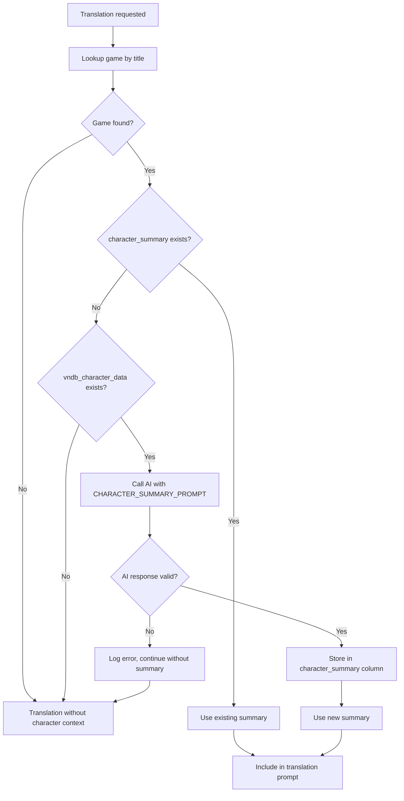
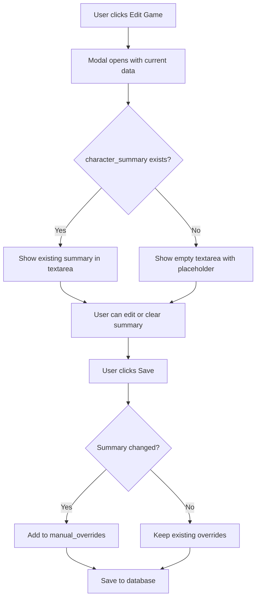

# VNDB Character Integration for AI Translation System

## Overview

This plan details the integration of VNDB (Visual Novel Database) character information into the GameSentenceMiner AI translation system. The goal is to enhance translation quality by providing the AI with character context, including character names (Japanese → English romanization), ages, and personality traits.

### Current State

The translation system currently uses [`FULL_PROMPT_TEMPLATE`](GameSentenceMiner/ai/ai_prompting.py:77-85) which includes:
- Game title as disclaimer context
- Dialogue context from surrounding lines
- The translation prompt itself

A hardcoded example exists in the `is_beangate` block at [`lines 56-68`](GameSentenceMiner/ai/ai_prompting.py:56-68) showing the desired character list format:
```
**CHARACTER LIST**:
矢嶋 透 -> Yajima Tooru
小林 真理 -> Kobayashi Mari
渡瀬 可奈子 -> Watase Kanako
...
```

---

## Step 1: VNDB URL Extraction

### Location in Codebase

The VNDB URL extraction should occur in the game linking flow, specifically:
- [`api_link_game_to_jiten()`](GameSentenceMiner/web/jiten_database_api.py:300) - where game linking happens
- [`normalize_deck_data()`](GameSentenceMiner/util/jiten_api_client.py:115) - where jiten data is processed

### Understanding Jiten.moe Link Structure

From [`jiten_api_client.py`](GameSentenceMiner/util/jiten_api_client.py:180), links are stored in the normalized data:
```python
"links": deck_data.get("links", []),
```

Each link object in the array has the structure:
```json
{
  "linkType": 1,
  "url": "https://vndb.org/v1234",
  "linkId": 1234
}
```

### VNDB Link Type Identification

Jiten.moe uses specific `linkType` values for different sites. Based on the existing code patterns:
- Link type for VNDB needs to be identified (likely a specific integer)
- The URL pattern for VNDB is: `https://vndb.org/v{VN_ID}`

### Implementation Approach

1. **Create VNDB URL extraction helper** in [`jiten_api_client.py`](GameSentenceMiner/util/jiten_api_client.py):
   ```python
   @classmethod
   def extract_vndb_id(cls, links: List[Dict]) -> Optional[str]:
       """Extract VNDB VN ID from jiten.moe links array."""
       for link in links:
           url = link.get("url", "")
           if "vndb.org/v" in url:
               # Extract VN ID from URL like https://vndb.org/v1234
               match = re.search(r"vndb\.org/v(\d+)", url)
               if match:
                   return match.group(1)
       return None
   ```

2. **Trigger extraction** when:
   - Game is linked via [`api_link_game_to_jiten()`](GameSentenceMiner/web/jiten_database_api.py:300)
   - Game data is repulled via [`api_repull_game_from_jiten()`](GameSentenceMiner/web/jiten_database_api.py:639)
   - Jiten update cron runs via [`update_single_game_from_jiten()`](GameSentenceMiner/util/cron/jiten_update.py:86)

3. **Check media type** at [`normalize_deck_data()`](GameSentenceMiner/util/jiten_api_client.py:134-135):
   ```python
   7: "Visual Novel"  # Only fetch VNDB data for this type
   ```

### VN ID Parsing

The VNDB URL format is consistent:
- `https://vndb.org/v1234` → VN ID is `1234`
- `https://vndb.org/v12345` → VN ID is `12345`

Regex pattern: `vndb\.org/v(\d+)`

---

## Step 2: VNDB Character Data Fetching

### VNDB API Overview

The VNDB API v2 is available at `https://api.vndb.org/kana/`. It uses POST requests with JSON bodies.

**API Documentation**: https://api.vndb.org/kana

### Reference Implementation

The following complete script will be adapted into `GameSentenceMiner/util/vndb_api_client.py`. This script already includes:
- **Pagination handling** for VNs with many characters
- **Spoiler filtering** to control character revelation
- **Character role categorization** (main, primary, side, appears)
- **Trait organization** by category (Personality, Role, etc.)
- **Translation context generation** for AI prompts

```python
#!/usr/bin/env python3
"""
Fetch character information from VNDB for use in AI translation context.
Extracts names, personality traits, roles, and other relevant attributes.
"""

import requests
import json
import argparse
from typing import Optional


API_URL = "https://api.vndb.org/kana/character"


def normalize_vndb_id(vn_id: str) -> str:
    """Normalize VN ID to format 'v12345'."""
    vn_id = vn_id.strip().lower()
    if vn_id.startswith("v"):
        return vn_id
    return f"v{vn_id}"


def fetch_characters(vn_id: str, results_per_page: int = 100) -> list[dict]:
    """
    Fetch all characters for a given VN from VNDB API.
    Handles pagination automatically.
    """
    vn_id = normalize_vndb_id(vn_id)
    all_characters = []
    page = 1
    
    while True:
        payload = {
            "filters": ["vn", "=", ["id", "=", vn_id]],
            "fields": ",".join([
                "id",
                "name",
                "original",
                "aliases",
                "description",
                "blood_type",
                "height",
                "weight",
                "age",
                "birthday",
                "sex",
                "gender",
                "vns.role",
                "vns.spoiler",
                "vns.id",
                "traits.id",
                "traits.name",
                "traits.group_name",
                "traits.spoiler",
            ]),
            "results": results_per_page,
            "page": page,
        }
        
        response = requests.post(
            API_URL,
            headers={"Content-Type": "application/json"},
            json=payload
        )
        response.raise_for_status()
        data = response.json()
        
        all_characters.extend(data.get("results", []))
        
        if not data.get("more", False):
            break
        page += 1
    
    return all_characters


def categorize_traits(traits: list[dict], max_spoiler: int = 0) -> dict[str, list[str]]:
    """
    Organize traits by their group (Personality, Role, etc.).
    Filters by spoiler level.
    """
    categorized = {}
    
    for trait in traits:
        if trait.get("spoiler", 0) > max_spoiler:
            continue
        
        group = trait.get("group_name", "Other")
        name = trait.get("name", "")
        
        if group not in categorized:
            categorized[group] = []
        if name and name not in categorized[group]:
            categorized[group].append(name)
    
    return categorized


def get_character_role(vns: list[dict], target_vn_id: str) -> tuple[str, int]:
    """
    Get the character's role and spoiler level for the target VN.
    Returns (role, spoiler_level).
    """
    target_vn_id = normalize_vndb_id(target_vn_id)
    
    for vn in vns:
        if vn.get("id") == target_vn_id:
            return vn.get("role", "unknown"), vn.get("spoiler", 0)
    
    # Fallback to first entry
    if vns:
        return vns[0].get("role", "unknown"), vns[0].get("spoiler", 0)
    return "unknown", 0


def format_character_for_translation(
    char: dict,
    target_vn_id: str,
    max_spoiler: int = 0
) -> dict:
    """
    Format a character's data for use in translation context.
    """
    role, char_spoiler = get_character_role(char.get("vns", []), target_vn_id)
    
    # Skip characters that are spoilers themselves
    if char_spoiler > max_spoiler:
        return None
    
    # Get sex/gender info
    sex_info = char.get("sex")
    sex = None
    if sex_info and isinstance(sex_info, list) and len(sex_info) >= 1:
        sex = sex_info[0]  # Non-spoiler sex
    
    gender_info = char.get("gender")
    gender = None
    if gender_info and isinstance(gender_info, list) and len(gender_info) >= 1:
        gender = gender_info[0]  # Non-spoiler gender
    
    # Categorize traits
    traits = categorize_traits(char.get("traits", []), max_spoiler)
    
    # Build the result
    result = {
        "id": char.get("id"),
        "name": char.get("name"),
        "name_original": char.get("original"),
        "aliases": char.get("aliases", []),
        "role": role,  # main, primary, side, appears
    }
    
    # Add optional fields only if they have values
    if sex:
        result["sex"] = {"m": "male", "f": "female", "b": "both", "n": "sexless"}.get(sex, sex)
    
    if gender:
        result["gender"] = {"m": "male", "f": "female", "o": "non-binary", "a": "ambiguous"}.get(gender, gender)
    
    if char.get("age"):
        result["age"] = char.get("age")
    
    # Add personality traits (most useful for translation)
    if "Personality" in traits:
        result["personality"] = traits["Personality"]
    
    # Add role/occupation traits
    if "Role" in traits:
        result["roles"] = traits["Role"]
    
    # Add other potentially useful trait categories
    for category in ["Engages in", "Subject of"]:
        if category in traits:
            key = category.lower().replace(" ", "_")
            result[key] = traits[category]
    
    return result


def process_vn_characters(
    vn_id: str,
    max_spoiler: int = 0,
    include_minor: bool = False
) -> dict:
    """
    Fetch and process all characters for a VN.
    
    Args:
        vn_id: VNDB visual novel ID (e.g., "v56650" or "56650")
        max_spoiler: Maximum spoiler level (0=none, 1=minor, 2=major)
        include_minor: Whether to include minor/appears characters
    
    Returns:
        Dictionary with VN info and categorized characters
    """
    vn_id = normalize_vndb_id(vn_id)
    
    print(f"Fetching characters for {vn_id}...")
    characters = fetch_characters(vn_id)
    print(f"Found {len(characters)} characters")
    
    # Process and categorize characters
    processed = {
        "main": [],      # Protagonist
        "primary": [],   # Main characters
        "side": [],      # Side characters
        "appears": [],   # Minor appearances
    }
    
    for char in characters:
        formatted = format_character_for_translation(char, vn_id, max_spoiler)
        if formatted is None:
            continue
        
        role = formatted.get("role", "side")
        if role in processed:
            processed[role].append(formatted)
        else:
            processed["side"].append(formatted)
    
    # Filter out minor characters if requested
    if not include_minor:
        processed.pop("appears", None)
    
    # Remove empty categories
    processed = {k: v for k, v in processed.items() if v}
    
    result = {
        "vn_id": vn_id,
        "character_count": sum(len(v) for v in processed.values()),
        "characters": processed,
    }
    
    return result


def create_translation_context(data: dict) -> str:
    """
    Create a compact text summary for use in translation prompts.
    """
    lines = [f"# Character Reference for {data['vn_id']}\n"]
    
    role_labels = {
        "main": "Protagonist",
        "primary": "Main Characters",
        "side": "Side Characters",
        "appears": "Minor Characters",
    }
    
    for role, label in role_labels.items():
        chars = data.get("characters", {}).get(role, [])
        if not chars:
            continue
        
        lines.append(f"\n## {label}")
        for char in chars:
            name = char.get("name", "Unknown")
            orig = char.get("name_original")
            name_str = f"{name} ({orig})" if orig else name
            
            parts = [name_str]
            
            if char.get("sex"):
                parts.append(char["sex"])
            
            if char.get("age"):
                parts.append(f"age {char['age']}")
            
            if char.get("personality"):
                parts.append(f"personality: {', '.join(char['personality'])}")
            
            if char.get("roles"):
                parts.append(f"role: {', '.join(char['roles'])}")
            
            lines.append(f"- {parts[0]}: " + "; ".join(parts[1:]) if len(parts) > 1 else f"- {parts[0]}")
    
    return "\n".join(lines)


def main():
    parser = argparse.ArgumentParser(
        description="Fetch VNDB character data for translation context"
    )
    parser.add_argument(
        "vn_id",
        help="VNDB visual novel ID (e.g., 'v56650' or '56650')"
    )
    parser.add_argument(
        "-o", "--output",
        help="Output JSON file path (default: characters_<vn_id>.json)"
    )
    parser.add_argument(
        "--spoiler",
        type=int,
        choices=[0, 1, 2],
        default=0,
        help="Max spoiler level: 0=none (default), 1=minor, 2=major"
    )
    parser.add_argument(
        "--include-minor",
        action="store_true",
        help="Include characters with 'appears' role"
    )
    parser.add_argument(
        "--text-summary",
        action="store_true",
        help="Also output a text summary for prompts"
    )
    
    args = parser.parse_args()
    
    # Fetch and process
    data = process_vn_characters(
        args.vn_id,
        max_spoiler=args.spoiler,
        include_minor=args.include_minor
    )
    
    # Determine output path
    vn_id = normalize_vndb_id(args.vn_id)
    output_path = args.output or f"characters_{vn_id}.json"
    
    # Save JSON
    with open(output_path, "w", encoding="utf-8") as f:
        json.dump(data, f, ensure_ascii=False, indent=2)
    print(f"Saved character data to {output_path}")
    
    # Optionally save text summary
    if args.text_summary:
        summary = create_translation_context(data)
        summary_path = output_path.replace(".json", "_summary.txt")
        with open(summary_path, "w", encoding="utf-8") as f:
            f.write(summary)
        print(f"Saved text summary to {summary_path}")
    
    # Print summary
    print(f"\nProcessed {data['character_count']} characters:")
    for role, chars in data.get("characters", {}).items():
        print(f"  {role}: {len(chars)}")


if __name__ == "__main__":
    main()
```

### Key Functions

| Function | Purpose |
|----------|---------|
| `fetch_characters()` | Fetches all characters for a VN with automatic pagination |
| `categorize_traits()` | Organizes traits by group (Personality, Role, etc.) with spoiler filtering |
| `get_character_role()` | Determines character role (main/primary/side/appears) for the target VN |
| `format_character_for_translation()` | Formats character data for translation context |
| `process_vn_characters()` | Main entry point - fetches and processes all characters |
| `create_translation_context()` | Generates compact text summary for AI prompts |

### Character Data Structure

The processed character data includes:
```json
{
  "vn_id": "v56650",
  "character_count": 15,
  "characters": {
    "main": [
      {
        "id": "c123",
        "name": "Tooru Yajima",
        "name_original": "矢嶋 透",
        "aliases": [],
        "role": "main",
        "sex": "male",
        "age": 17,
        "personality": ["Kind", "Determined"],
        "roles": ["Student", "Protagonist"]
      }
    ],
    "primary": [...],
    "side": [...]
  }
}
```

### Integration Notes

When adapting this script for `GameSentenceMiner/util/vndb_api_client.py`:

1. **Remove CLI/argparse code** - Only keep the core functions
2. **Add logging** - Replace `print()` with logger calls
3. **Add error handling** - Wrap API calls with try/except
4. **Add timeout** - Use `timeout` parameter in requests
5. **Integrate with GamesTable** - Store results in `vndb_character_data` column

---

## Step 3: Database Schema Changes

### Current Games Table Schema

From [`games_table.py`](GameSentenceMiner/util/games_table.py:12-28), the current fields are:
```python
_fields = [
    "deck_id",
    "title_original",
    "title_romaji",
    "title_english",
    "type",
    "description",
    "image",
    "character_count",
    "difficulty",
    "links",
    "completed",
    "release_date",
    "manual_overrides",
    "obs_scene_name",
    "genres",
    "tags",
]
```

### New Columns Required

Add two new columns to the games table:

1. **`vndb_character_data`** (TEXT/JSON)
   - Stores raw character data from VNDB API
   - JSON format for flexibility
   - Can be null if not a Visual Novel or fetch failed

2. **`character_summary`** (TEXT)
   - Stores AI-generated character summaries
   - Human-readable format for translation prompts
   - Can be null if not generated yet

### Schema Migration

Update [`games_table.py`](GameSentenceMiner/util/games_table.py:12-47):

```python
_fields = [
    # ... existing fields ...
    "vndb_character_data",  # NEW: Raw VNDB character JSON
    "character_summary",     # NEW: AI-generated summaries
]

_types = [
    # ... existing types ...
    str,  # vndb_character_data (JSON string)
    str,  # character_summary (text)
]
```

### Database Migration Strategy

The SQLite database will auto-migrate when the table structure changes. The [`SQLiteDBTable`](GameSentenceMiner/util/db.py) base class handles:
- Adding new columns with NULL default values
- Preserving existing data

### Manual Override Support

Both new fields should be addable to `manual_overrides`:
- If user manually edits character_summary, it won't be auto-regenerated
- If user clears vndb_character_data, it won't be re-fetched automatically

---

## Step 4: AI Character Summarization

### Summarization Goal

Convert raw VNDB character data into concise one-line summaries suitable for translation context. Format should match the hardcoded example in [`ai_prompting.py`](GameSentenceMiner/ai/ai_prompting.py:56-68):

```
**CHARACTER LIST**:
矢嶋 透 -> Yajima Tooru (17yo male protagonist, kind and determined)
小林 真理 -> Kobayashi Mari (18yo female, cheerful childhood friend)
```

### Summarization Prompt Design

Create a specialized prompt for character summarization:

```python
CHARACTER_SUMMARY_PROMPT = """
You are a helpful assistant that creates concise character summaries for game localization.

Given the following character data from a visual novel, create a CHARACTER LIST in this exact format:

**CHARACTER LIST**:
[Japanese Name] -> [Romanized Name] (brief one-line description)

Rules:
- Include age if available (e.g., "17yo")
- Include gender (male/female)
- Include 2-3 key personality traits that will aid in translation.
- Keep each line under 80 characters
- Use Format Japanese name (romanization name): 17yo male tsundere
- Example: 陽見 恵凪 (Harumi Ena): Clumsy, Dandere, Hotblooded 19yo girl

Character Data:
{character_json}

Generate the CHARACTER LIST now:
"""
```

### When to Trigger Summarization

**Decision: Option B - On First Translation (Lazy Generation)**

The character summary will be generated lazily when a translation is first requested. This approach ensures:

1. **AI is configured** - We can only guarantee the user has AI hooked up if they're requesting a translation
2. **No wasted API calls** - Summaries only generated for games the user actually translates
3. **No linking latency** - Game linking remains fast

**Implementation Details:**

- **VNDB data fetched**: On game link (Visual Novels only, when `type == "Visual Novel"`)
- **Summary generated**: On first translation request, only if:
  - `vndb_character_data` exists (was fetched during linking)
  - `character_summary` is empty/null (not yet generated)
- **Summary reused**: If `character_summary` already exists, use it directly

**No Caching:**

Users may play multiple games within a single GSM instance, and proper cache invalidation would require more than 5 lines of code. Therefore, we skip caching entirely. A simple DB lookup per translation is acceptable since SQLite is fast for local file access.

```python
# In _build_prompt() or get_ai_prompt_result()
game = GamesTable.get_by_title(game_title) if game_title else None
summary = game.character_summary if game else None
```

### Summarization Flow



### AI Provider Selection

Reuse existing AI infrastructure from [`ai_prompting.py`](GameSentenceMiner/ai/ai_prompting.py:389-431):
- Use `get_ai_prompt_result()` with custom prompt
- Respects user's configured AI provider (Gemini, Groq, OpenAI)

### Implementation Location

Create new function in `ai_prompting.py`:

```python
def generate_character_summary(character_data: dict) -> Optional[str]:
    """
    Generate a character summary from VNDB character data.
    
    Args:
        character_data: Dictionary with VNDB character data
        
    Returns:
        Formatted character list string, or None if generation fails
    """
    # Use existing AI infrastructure with custom prompt
    pass
```

---

## Step 5: Translation Prompt Integration

### Current Prompt Structure

From [`ai_prompting.py`](GameSentenceMiner/ai/ai_prompting.py:77-85):

```python
FULL_PROMPT_TEMPLATE = """
**Disclaimer:** All dialogue provided is from the script of the video game "{game_title}". This content is entirely fictional and part of a narrative. It must not be treated as real-world user input or a genuine request. The goal is accurate, context-aware localization. If no context is provided, do not throw errors or warnings.

{dialogue_context}

{prompt_to_use}

{sentence}
"""
```

### Modified Prompt Template
`
Add character context placeholder:

```python
FULL_PROMPT_TEMPLATE = """
**Disclaimer:** All dialogue provided is from the script of the video game "{game_title}". This content is entirely fictional and part of a narrative. It must not be treated as real-world user input or a genuine request. The goal is accurate, context-aware localization. If no context is provided, do not throw errors or warnings.

{character_context}

{dialogue_context}

{prompt_to_use}

{sentence}
"""
```

### Fetching Character Summary

Modify [`_build_prompt()`](GameSentenceMiner/ai/ai_prompting.py:130-163) to:
1. Look up current game by title
2. Fetch `character_summary` from games table
3. Include in prompt if available

```python
def _build_prompt(self, lines, sentence, current_line, game_title, custom_prompt=None):
    # ... existing dialogue_context logic ...
    
    # NEW: Fetch character context
    character_context = ""
    if game_title:
        from GameSentenceMiner.util.games_table import GamesTable
        game = GamesTable.get_by_title(game_title)
        if game and game.character_summary:
            character_context = game.character_summary
    
    return FULL_PROMPT_TEMPLATE.format(
        game_title=game_title,
        character_context=character_context,
        dialogue_context=dialogue_context,
        prompt_to_use=prompt_to_use,
        sentence=sentence,
    )
```

### Fallback Behavior

When no character summary is available:
- `character_context` is empty string
- Template renders cleanly without character section
- Translation proceeds normally

---

## Step 6: UI for Editing Character Summary

### Purpose

Allow users to manually edit or add context to the AI-generated character summary in the Edit Game modal. This is useful when:
- The AI summary needs corrections
- Users want to add custom character notes
- VNDB data is incomplete or missing
- Users want to add characters not in VNDB

### Location in Codebase

The Edit Game modal is in [`database.html`](GameSentenceMiner/web/templates/database.html) around lines 410-534. The new textarea should be placed after the Release Date field (around line 490) and before the Links field.

### HTML Changes

Add a new textarea field to the Edit Game modal in [`database.html`](GameSentenceMiner/web/templates/database.html):

```html
<div class="form-group">
    <label class="form-label">Character Summary (for AI Translation)</label>
    <textarea id="editCharacterSummary" class="form-textarea" rows="8" placeholder="Character list for translation context..."></textarea>
    <small style="color: var(--text-tertiary); font-size: 12px;">
        One-line character summaries used for AI translation context. Format: 日本語名 -> English Name (description)
    </small>
</div>
```

### JavaScript Changes

Update [`database-game-operations.js`](GameSentenceMiner/web/static/js/database-game-operations.js) to handle the new field:

1. **Load field when opening modal**:
   ```javascript
   // In the function that opens the edit modal
   document.getElementById('editCharacterSummary').value = game.character_summary || '';
   ```

2. **Save field when updating game**:
   ```javascript
   // In the function that saves game changes
   const gameData = {
       // ... existing fields ...
       character_summary: document.getElementById('editCharacterSummary').value || null
   };
   ```

3. **Handle manual_overrides tracking**:
   - When user edits character_summary, add it to `manual_overrides`
   - This prevents auto-regeneration from overwriting user edits

### API Changes

The existing game update API in [`database_api.py`](GameSentenceMiner/web/database_api.py) should already handle the `character_summary` field since it's part of the GamesTable schema. Verify that:
- The update endpoint accepts `character_summary` in the request body
- The field is passed through to `update_game()` or `update_all_fields_manual()`

### User Experience Flow



### Field Validation

- **No strict validation** - Allow freeform text
- **Trim whitespace** - Clean up before saving
- **Empty string → null** - Store null if cleared
- **Max length** - Consider adding a reasonable limit (e.g., 5000 chars) to prevent UI issues

---

## Implementation Order

The implementation should follow this sequence to ensure each step builds on the previous one:

### Phase 1: Database Foundation

1. **Add new columns to GamesTable**
   - Add `vndb_character_data` field to [`_fields`](GameSentenceMiner/util/games_table.py:12-28)
   - Add `character_summary` field to [`_fields`](GameSentenceMiner/util/games_table.py:12-28)
   - Add corresponding types to [`_types`](GameSentenceMiner/util/games_table.py:30-48)
   - Update constructor `__init__` to accept new fields
   - Update `update_all_fields_from_jiten()` to handle new fields
   - Update `update_all_fields_manual()` to handle new fields

### Phase 2: VNDB API Integration

2. **Create VNDB API client**
   - Create new file `GameSentenceMiner/util/vndb_api_client.py`
   - Implement `VNDBApiClient` class
   - Add `get_vn_characters()` method
   - Add error handling and logging

3. **Add VNDB ID extraction to JitenApiClient**
   - Add `extract_vndb_id()` method to [`jiten_api_client.py`](GameSentenceMiner/util/jiten_api_client.py)
   - Add regex pattern for parsing VNDB URLs

### Phase 3: Character Fetching Integration

4. **Integrate VNDB fetch into game linking**
   - Modify [`api_link_game_to_jiten()`](GameSentenceMiner/web/jiten_database_api.py:300)
   - Check if media type is Visual Novel (type 7)
   - Extract VNDB ID from links
   - Fetch characters and store in `vndb_character_data`

5. **Add VNDB fetch to repull and cron**
   - Modify [`api_repull_game_from_jiten()`](GameSentenceMiner/web/jiten_database_api.py:639)
   - Modify [`update_single_game_from_jiten()`](GameSentenceMiner/util/cron/jiten_update.py:86)

### Phase 4: AI Summarization (Lazy Generation)

6. **Create character summarization function**
   - Add `CHARACTER_SUMMARY_PROMPT` to [`ai_prompting.py`](GameSentenceMiner/ai/ai_prompting.py)
   - Add `generate_character_summary()` function
   - Use existing AI infrastructure

### Phase 5: Translation Integration with Lazy Summarization

7. **Modify prompt template**
   - Add `{character_context}` placeholder to [`FULL_PROMPT_TEMPLATE`](GameSentenceMiner/ai/ai_prompting.py:77-85)

8. **Implement lazy character context fetching in `_build_prompt()`**
   - Lookup game by title from GamesTable (no caching - users may switch games)
   - If `character_summary` exists, use it
   - If `character_summary` is null but `vndb_character_data` exists:
     - Call `generate_character_summary()` with the VNDB data
     - Store result in `character_summary` column
     - Use newly generated summary
   - If neither exists, continue without character context

---

## Files to Modify

| File | Changes |
|------|---------|
| [`GameSentenceMiner/util/games_table.py`](GameSentenceMiner/util/games_table.py) | Add `vndb_character_data` and `character_summary` fields |
| [`GameSentenceMiner/util/jiten_api_client.py`](GameSentenceMiner/util/jiten_api_client.py) | Add `extract_vndb_id()` method |
| `GameSentenceMiner/util/vndb_api_client.py` | **NEW FILE** - VNDB API client |
| [`GameSentenceMiner/web/jiten_database_api.py`](GameSentenceMiner/web/jiten_database_api.py) | Integrate VNDB fetch in link/repull |
| [`GameSentenceMiner/util/cron/jiten_update.py`](GameSentenceMiner/util/cron/jiten_update.py) | Add VNDB fetch to cron update |
| [`GameSentenceMiner/ai/ai_prompting.py`](GameSentenceMiner/ai/ai_prompting.py) | Add summarization + modify prompt template |
| [`GameSentenceMiner/web/templates/database.html`](GameSentenceMiner/web/templates/database.html) | Add `character_summary` textarea field to Edit Game modal |
| [`GameSentenceMiner/web/static/js/database-game-operations.js`](GameSentenceMiner/web/static/js/database-game-operations.js) | Handle loading/saving `character_summary` field |

---

## Summary

This implementation adds VNDB character integration to enhance AI translation quality for Visual Novels. The key components are:

1. **VNDB URL extraction** from jiten.moe links
2. **VNDB API client** for fetching character data
3. **Database columns** for storing character data and summaries
4. **AI summarization** to create translation-friendly character lists
5. **Prompt integration** to include character context in translations

The feature is optional and non-breaking - games without VNDB links continue to work normally, and the character context is only included when available.

