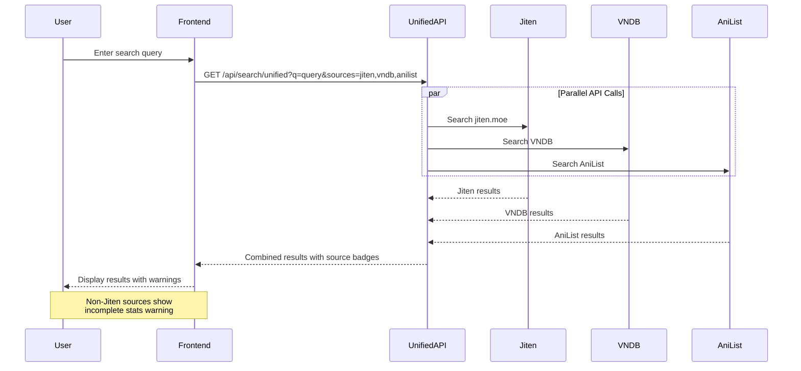
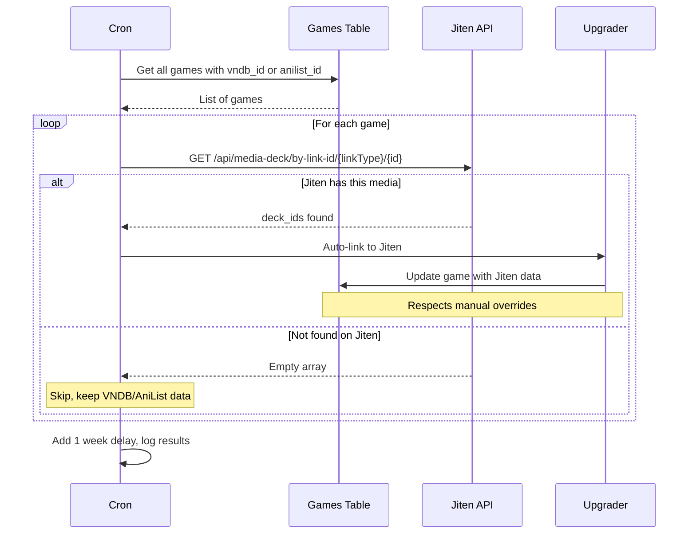

# Unified Search & Jiten Upgrader Implementation Plan

## Overview

This plan implements two major features:
1. **Unified Search API & UI**: Search across Jiten.moe, VNDB, and AniList simultaneously
2. **Jiten Upgrader Cron**: Weekly job to auto-upgrade games from VNDB/AniList to Jiten when available

## System Architecture

```mermaid
graph TB
    subgraph Frontend
        SearchUI[Unified Search UI]
        SourceToggles[Source Toggles: Jiten/VNDB/AniList]
        ResultsList[Search Results with Badges]
    end
    
    subgraph Backend
        UnifiedAPI[/api/search/unified]
        JitenSearch[Jiten Search API]
        VNDBSearch[VNDB Search API]
        AniListSearch[AniList Search API]
    end
    
    subgraph CronSystem
        WeeklyCron[Weekly Jiten Upgrader]
        CheckGames[Check All Games with vndb_id/anilist_id]
        JitenLookup[Query Jiten by Link ID]
        AutoUpgrade[Auto-link to Jiten if Found]
    end
    
    SearchUI --> SourceToggles
    SearchUI --> UnifiedAPI
    UnifiedAPI --> JitenSearch
    UnifiedAPI --> VNDBSearch
    UnifiedAPI --> AniListSearch
    UnifiedAPI --> ResultsList
    
    WeeklyCron --> CheckGames
    CheckGames --> JitenLookup
    JitenLookup --> AutoUpgrade
```

## Data Flow: Unified Search



## Data Flow: Jiten Upgrader Cron



## Implementation Details

### 1. Unified Search API Endpoint

**File**: `GameSentenceMiner/web/jiten_database_api.py`

```python
@app.route('/api/search/unified', methods=['GET'])
def api_unified_search():
    """
    Search across Jiten, VNDB, and AniList simultaneously.
    
    Query Parameters:
    - q: Search query (required)
    - sources: Comma-separated list of sources (default: jiten,vndb,anilist)
    
    Returns:
    {
        "jiten": {"results": [...], "total": 10},
        "vndb": {"results": [...], "total": 5},
        "anilist": {"results": [...], "total": 8}
    }
    """
```

External API specifications
AniList GraphQL API
The AniList API at https://graphql.anilist.co uses GraphQL over HTTP POST. No authentication is required for searching anime/manga metadata—only user-specific operations require OAuth2. AniList
pythondef search_anilist(query: str, media_type: str = "ANIME") -> dict:
    graphql_query = '''
    query ($search: String!, $type: MediaType) {
        Page(page: 1, perPage: 10) {
            media(search: $search, type: $type) {
                id
                idMal
                title { romaji english native }
                description(asHtml: false)
                coverImage { large medium }
                format
                status
                averageScore
                siteUrl
            }
        }
    }
    '''
    response = requests.post(
        "https://graphql.anilist.co",
        json={"query": graphql_query, "variables": {"search": query, "type": media_type}},
        headers={"Content-Type": "application/json"}
    )
    return response.json()
Rate limit: 90 requests per minute. AniList Best practice is spacing requests ~700ms apart and tracking the X-RateLimit-Remaining header. The API returns both the AniList ID and MyAnimeList ID (idMal), useful for cross-referencing.
VNDB Kana API
VNDB's modern API at https://api.vndb.org/kana uses HTTP POST with JSON payloads. GitHub Authentication is optional for VN searches—only user list operations require an API token.
pythondef search_vndb(query: str, limit: int = 10) -> dict:
    payload = {
        "filters": ["search", "=", query],
        "fields": "id, title, alttitle, released, rating, description, image.url, developers.name",
        "sort": "rating",
        "reverse": True,
        "results": limit
    }
    response = requests.post(
        "https://api.vndb.org/kana/vn",
        json=payload,
        headers={"Content-Type": "application/json"}
    )
    return response.json()
Rate limit: 200 requests per 5 minutes. Pragunsaini VNDB IDs are strings like "v17" (for Steins;Gate). The API supports complex filter combinations using ["and", ...] or ["or", ...] predicates.

**Key Features**:
- Timeout handling (10-15 seconds per source)
- Consistent result format across all sources

### 2. LinkType Mapping

Based on [Jiten.Core LinkType](https://github.com/Sirush/Jiten/blob/master/Jiten.Core/Data/LinkType.cs):

```python
class JitenLinkType:
    """Jiten.moe external link types"""
    OFFICIAL = 1
    VNDB = 2
    ANILIST = 3
    MAL = 4
    # ... other types
```

Other types are:
{
    Web = 1,
    Vndb = 2,
    Tmdb = 3,
    Anilist = 4,
    Mal = 5, // Myanimelist
    GoogleBooks = 6,
    Imdb = 7,
    Igdb = 8,
    Syosetsu = 9
}

**API Endpoint**: `https://api.jiten.moe/api/media-deck/by-link-id/{linkType}/{id}`

Examples:
- VNDB: `by-link-id/2/v17` (Steins;Gate)
- AniList: `by-link-id/3/149544` (某魔女漫画)

Add this API to GameSentenceMiner/util/jiten_api_client.py

### 3. Jiten Upgrader Cron Module

**File**: `GameSentenceMiner/util/cron/jiten_upgrader.py`

**Core Logic**:
```python
def upgrade_games_to_jiten():
    """
    Check all games with vndb_id or anilist_id to see if Jiten now has them.
    Auto-link to Jiten if found, respecting manual overrides.
    
    Returns:
        {
            'total_checked': int,
            'upgraded_to_jiten': int,
            'already_on_jiten': int,
            'not_found_on_jiten': int,
            'failed': int,
            'details': [...]
        }
    """
```

**Weekly Execution Flow**:
1. Query all games where `vndb_id IS NOT NULL OR anilist_id IS NOT NULL`
2. For each game:
   - Skip if already linked to Jiten (`deck_id` is set)
   - Determine LinkType (2 for VNDB, 3 for AniList)
   - Call `/api/media-deck/by-link-id/{linkType}/{id}`
   - If deck_id(s) found:
     - Fetch full Jiten metadata
     - Call existing `link_game_to_jiten()` logic
     - Respects manual overrides
     - Downloads character data
3. Add 1 second delay between API calls
4. Log summary statistics

### 4. Frontend Unified Search Component

**File**: `GameSentenceMiner/web/static/js/unified-search.js`

**Features**:
- Debounced search input (300ms delay)
- Source toggle checkboxes (Jiten/VNDB/AniList)
- Result cards with:
  - Source badge (color-coded but with name)
  - Warning for non-Jiten sources: "⚠️ Will not have complete stats"
  - Cover image
  - Title (original/romaji/english)
  - Link button

**Badge Indicators**:
- 🟢 **Jiten**: Green badge, full stats
- 🔵 **VNDB**: Blue badge, "Visual Novel data only - limited stats"
- 🟠 **AniList**: Orange badge, "Anime/Manga data only - limited stats"

### 5. Integration Points

**Modified Files**:
1. `GameSentenceMiner/util/jiten_api_client.py`
   - Add `get_deck_by_link_id(link_type, external_id)` method
   
2. `GameSentenceMiner/util/cron/run_crons.py`
   - Add `JITEN_UPGRADER` to `Crons` enum
   - Add execution handler in main loop
   
3. `GameSentenceMiner/web/jiten_database_api.py`
   - Add `/api/search/unified` endpoint
   
4. `GameSentenceMiner/web/templates/database.html`
   - Add unified search UI component
   - Show VNDB/AniList IDs in game cards
   
5. `GameSentenceMiner/util/cron/setup_jiten_upgrader_cron.py` (NEW)
   - Setup script for weekly schedule

## Error Handling & Edge Cases

### API Failures
- **Timeout**: 15 second timeout per source, return partial results
- **Rate Limiting**: Exponential backoff, respect API limits
- **Network Errors**: Log and continue with other sources

### Data Conflicts
- **Multiple Jiten Matches**: In search present all to user, assume this does not happen with get_link_by_id
- **Manual Overrides**: Never overwrite user-edited fields
- **Duplicate Links**: Check for existing deck_id before upgrading

### Cron Job Safety
- **Partial Failures**: Continue processing remaining games
- **Logging**: Detailed logs for debugging and monitoring

## Testing Strategy

### User Acceptance
- [x] Search for known games across all sources
- [x] Verify source badges display correctly
- [x] Verify warnings show for non-Jiten sources
- [x] Trigger manual jiten_upgrader run
- [x] Verify games upgrade correctly

## Rollout Plan

### Phase 1: Backend Infrastructure ✅
1. Add LinkType constants and helper methods
2. Implement `/api/search/unified` endpoint
3. Test with Postman/curl

### Phase 2: Frontend UI ✅
1. Create unified search component
2. Add source badges and warnings
3. Integrate with database page

### Phase 3: Jiten Upgrader Cron ✅
1. Implement jiten_upgrader module
2. Add to cron system
3. Test with manual execution

### Phase 4: Testing & Refinement ✅
1. End-to-end testing
2. Performance optimization
3. Documentation updates

---

## Completion Summary

**Completed on**: January 5, 2026

### Files Created
- `GameSentenceMiner/web/static/js/unified-search.js` - Unified search JavaScript module
- `GameSentenceMiner/util/cron/jiten_upgrader.py` - Weekly cron job for auto-upgrading games
- `GameSentenceMiner/util/cron/setup_jiten_upgrader_cron.py` - Cron setup script

### Files Modified
- `GameSentenceMiner/util/jiten_api_client.py` - Added JitenLinkType constants and get_deck_by_link_id()
- `GameSentenceMiner/util/anilist_api_client.py` - Added search_media()
- `GameSentenceMiner/util/vndb_api_client.py` - Added search_vn()
- `GameSentenceMiner/web/jiten_database_api.py` - Added unified search and cron trigger endpoints
- `GameSentenceMiner/web/static/css/search.css` - Added unified search styles
- `GameSentenceMiner/web/templates/database.html` - Added source toggles and UI
- `GameSentenceMiner/web/static/js/database-jiten-integration.js` - Integrated unified search
- `GameSentenceMiner/util/cron/run_crons.py` - Added JITEN_UPGRADER cron

### API Endpoints Added
- `GET /api/search/unified` - Parallel search across Jiten, VNDB, and AniList
- `POST /api/cron/jiten-upgrader/run` - Manual trigger for Jiten upgrader

### Schedule
- Jiten Upgrader: Runs weekly on Sunday at 3:00 AM local time