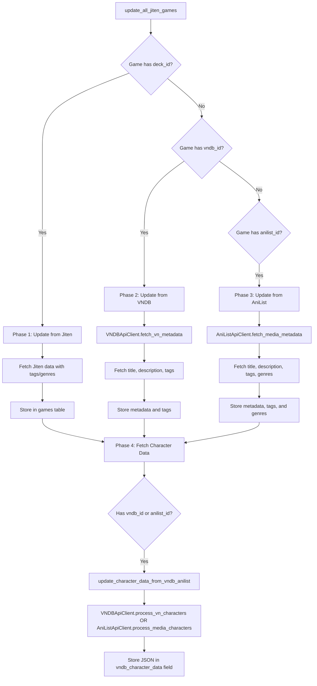

# VNDB & AniList Tags/Genres Integration Plan

## Current Status Analysis

### ✅ Already Working
- **Character Data Collection**: The function `update_character_data_from_vndb_anilist()` in [`jiten_update.py`](../GameSentenceMiner/util/cron/jiten_update.py:93-173) is already implemented and running in Phase 4 of the update process
- **Database Schema**: `genres` and `tags` fields exist in [`games_table.py`](../GameSentenceMiner/util/games_table.py:27-28) and are stored as JSON arrays
- **Jiten Integration**: Tags and genres from Jiten.moe are already being fetched and stored via [`jiten_api_client.py`](../GameSentenceMiner/util/jiten_api_client.py:183-188)

### ❌ Missing Functionality
- VNDB tags and genres are NOT being fetched in `VNDBApiClient.fetch_vn_metadata()`
- AniList tags and genres are NOT being fetched in `AniListApiClient.fetch_media_metadata()`
- The update flow doesn't store tags/genres from VNDB/AniList sources

## Implementation Plan

### 1. Extend VNDB Metadata Fetching

**File**: [`GameSentenceMiner/util/vndb_api_client.py`](../GameSentenceMiner/util/vndb_api_client.py)

**Function**: `fetch_vn_metadata()` (lines 312-377)

**Changes Needed**:
- Add `tags.name, tags.category, tags.rating` to the fields list in the API payload
- Parse and normalize the tags from the response
- Add tags/genres to the returned dictionary

**VNDB API Structure**:
```python
payload = {
    "filters": ["id", "=", vn_id],
    "fields": "id, title, alttitle, released, rating, description, image.url, developers.name, length_minutes, tags.name, tags.category, tags.rating",
    "results": 1
}
```

**Expected Response Format**:
```json
{
  "tags": [
    {
      "name": "Romance",
      "category": "cont",  // "cont" = content, "tech" = technical, etc.
      "rating": 2.5        // How applicable the tag is (0-3)
    }
  ]
}
```

**Return Format**:
```python
return {
    # ... existing fields ...
    "tags": [tag["name"] for tag in vn_data.get("tags", [])],
    "genres": []  # VNDB uses tags system, no separate genres
}
```

### 2. Extend AniList Metadata Fetching

**File**: [`GameSentenceMiner/util/anilist_api_client.py`](../GameSentenceMiner/util/anilist_api_client.py)

**GraphQL Query**: `MEDIA_BY_ID_QUERY` (lines 121-147)

**Changes Needed**:
- Add `genres` and `tags` fields to the GraphQL query
- Parse the response arrays
- Add to the returned metadata dictionary

**Updated GraphQL Query**:
```graphql
query ($id: Int!, $type: MediaType) {
    Media(id: $id, type: $type) {
        id
        title {
            romaji
            english
            native
        }
        description(asHtml: false)
        coverImage {
            extraLarge
            large
            medium
        }
        format
        status
        averageScore
        siteUrl
        startDate {
            year
            month
            day
        }
        genres  # Array of genre strings
        tags {  # Array of tag objects
            name
            rank    # Relevance percentage (0-100)
            isMediaSpoiler
        }
    }
}
```

**Return Format**:
```python
return {
    # ... existing fields ...
    "genres": media_data.get("genres", []),  # List of strings
    "tags": [tag["name"] for tag in media_data.get("tags", []) if not tag.get("isMediaSpoiler", False)]
}
```

### 3. Update Storage Logic

**File**: [`GameSentenceMiner/util/cron/jiten_update.py`](../GameSentenceMiner/util/cron/jiten_update.py)

**Function**: `update_game_from_vndb_or_anilist()` (lines 227-364)

**Changes Needed**:

**VNDB Section** (around line 251):
```python
if game.vndb_id:
    try:
        vndb_metadata = VNDBApiClient.fetch_vn_metadata(game.vndb_id)
        if vndb_metadata:
            sources_used.append("vndb")
            
            # ... existing field updates ...
            
            # NEW: Add tags and genres
            if "tags" not in manual_overrides and vndb_metadata.get("tags"):
                update_fields["tags"] = vndb_metadata["tags"]
            elif "tags" in manual_overrides:
                skipped_fields.append("tags")
            
            if "genres" not in manual_overrides and vndb_metadata.get("genres"):
                update_fields["genres"] = vndb_metadata["genres"]
            elif "genres" in manual_overrides:
                skipped_fields.append("genres")
```

**AniList Section** (around line 298):
```python
if game.anilist_id and not game.vndb_id:
    try:
        anilist_metadata = AniListApiClient.fetch_media_metadata(int(game.anilist_id), media_type)
        if anilist_metadata:
            sources_used.append("anilist")
            
            # ... existing field updates ...
            
            # NEW: Add tags and genres (respecting manual overrides)
            if "tags" not in manual_overrides and anilist_metadata.get("tags"):
                update_fields["tags"] = anilist_metadata["tags"]
            elif "tags" in manual_overrides:
                skipped_fields.append("tags")
            
            if "genres" not in manual_overrides and anilist_metadata.get("genres"):
                update_fields["genres"] = anilist_metadata["genres"]
            elif "genres" in manual_overrides:
                skipped_fields.append("genres")
```

**Important Note**: Jiten data ALWAYS overwrites tags/genres (see [`jiten_upgrader.py`](../GameSentenceMiner/util/cron/jiten_upgrader.py:293-297) and [`jiten_update.py`](../GameSentenceMiner/util/cron/jiten_update.py:466-474)). Manual overrides are only respected for VNDB/AniList sources. This creates a priority hierarchy:
1. **Jiten.moe** (highest priority - always overwrites)
2. **Manual user edits** (for VNDB/AniList)
3. **VNDB/AniList automatic data** (lowest priority)

### 4. Verification Steps

**Character Data Collection** (Already Working):
- Verify `update_character_data_from_vndb_anilist()` is called in Phase 4 (line 751)
- Confirm it handles both VNDB (lines 116-131) and AniList (lines 134-157)
- Check that it stores data in `game.vndb_character_data` as JSON string

**Testing Checklist**:
1. Test VNDB game: Fetch metadata, verify tags are retrieved and stored
2. Test AniList anime: Fetch metadata, verify tags/genres are retrieved and stored
3. Test AniList manga: Fetch metadata, verify tags/genres are retrieved and stored
4. Test character data: Verify `vndb_character_data` field is populated with JSON
5. Test manual override: Ensure manually set tags/genres are not overwritten
6. Verify database: Check that `genres` and `tags` columns contain JSON arrays

## Data Flow Diagram



## API Rate Limits

- **VNDB**: 200 requests per 5 minutes
- **AniList**: 90 requests per minute

Current implementation already includes delays:
- 1 second between Jiten games (line 650)
- 1 second between VNDB games (line 695)
- 1 second between AniList games (line 740)
- 0.5 seconds between character data fetches (line 759)

## Notes

1. **VNDB Tag System**: VNDB doesn't have a separate "genres" concept - it uses a comprehensive tag system with categories. We can filter tags by category if needed (e.g., `category == "cont"` for content tags).

2. **AniList Spoiler Filtering**: AniList tags have an `isMediaSpoiler` flag. We should exclude these from the stored tags to avoid spoilers.

3. **Manual Overrides**: The system respects manual overrides stored in `game.manual_overrides`. If a user manually sets tags/genres, they won't be overwritten by automatic updates.

4. **Character Data**: Already working! The `vndb_character_data` field stores the complete character JSON from either VNDB or AniList, including character names, descriptions, images (as base64 thumbnails), traits/roles, and spoiler level metadata.

## Success Criteria

- [ ] VNDB games have tags stored in the `tags` field
- [ ] AniList anime/manga have both tags AND genres stored
- [ ] Character data continues to be fetched and stored correctly
- [ ] Manual overrides for tags/genres are respected
- [ ] No API rate limit violations occur during updates
- [ ] All existing functionality continues to work
