# Yomitan Dictionary Generator for VNDB Characters

## Overview

Create a new utility that generates Yomitan-compatible dictionaries from VNDB character data. The dictionary will contain character names with their readings, images, and detailed profiles that can be looked up in Yomitan while reading visual novels.

## User Requirements

1. **Dictionary title**: Use the game name from `GamesTable.title_original`
2. **UI Integration**: Add a 📘 button next to the session navigation buttons (← → 🗑️) in the overview page
3. **One-click download**: When clicked, generate and download a Yomitan dictionary for the current game
4. **Alias support**: Each character alias gets its own dictionary entry pointing to the same content
5. **Spoiler level**: Default to 0 (no spoilers)

## Architecture


## Data Flow

### Input: Character Data from VNDBApiClient

The [`VNDBApiClient.process_vn_characters()`](GameSentenceMiner/util/vndb_api_client.py:375) method returns:

```python
{
    "vn_id": "v56650",
    "character_count": 15,
    "characters": {
        "main": [...],      # Protagonists
        "primary": [...],   # Main characters
        "side": [...],      # Side characters
        "appears": [...]    # Minor appearances
    }
}
```

Each character object contains:
- `id`: VNDB character ID
- `name`: Romanized name
- `name_original`: Japanese name - this becomes the dictionary term
- `aliases`: List of alternate names
- `role`: main/primary/side/appears
- `description`: Character description
- `sex`: male/female/both/sexless
- `gender`: male/female/non-binary/ambiguous
- `age`: Character age
- `blood_type`: Blood type
- `height`: Height in cm
- `weight`: Weight in kg
- `birthday`: Birthday as list [month, day]
- `image_url`: Original image URL
- `image_base64`: Base64-encoded JPEG thumbnail - needs to be decoded
- `personality`: List of personality traits
- `roles`: List of role traits

### Output: Yomitan Dictionary ZIP

The ZIP file will contain:
1. `index.json` - Dictionary metadata
2. `term_bank_1.json` - Character entries
3. `tag_bank_1.json` - Tag definitions for roles/categories
4. `img/` folder - Character images extracted from base64

## Structured Content Design

Each character entry will display in Yomitan with this layout:

```
┌─────────────────────────────────────────┐
│  [Character Image]                      │
│                                         │
│  Romanji Name                           │
│  Role: Main Character                   │
│  ─────────────────────                  │
│  Sex: Female | Age: 17                  │
│  Height: 165cm | Blood Type: A          │
│                                         │
│  Personality:                           │
│  • Cheerful                             │
│  • Energetic                            │
│  • Kind                                 │
│                                         │
│  Roles:                                 │
│  • Student                              │
│  • Childhood Friend                     │
│                                         │
│  ▼ Description                          │
│    [Collapsible description text]       │
└─────────────────────────────────────────┘
```

## Implementation Details

### 1. YomitanDictBuilder Class

Location: `GameSentenceMiner/util/yomitan_dict.py`

```python
class YomitanDictBuilder:
    def __init__(self, title: str, vn_id: str, revision: str = None):
        # Initialize dictionary metadata
        
    def add_character(self, char: Dict) -> None:
        # Process a single character and add to entries
        
    def _decode_image(self, base64_data: str, char_id: str) -> str:
        # Decode base64 to image bytes, return path for ZIP
        
    def _build_structured_content(self, char: Dict, image_path: str) -> Dict:
        # Build Yomitan structured content object
        
    def _create_index(self) -> Dict:
        # Generate index.json content
        
    def _create_tag_bank(self) -> List:
        # Generate tag definitions
        
    def export(self, output_path: str) -> str:
        # Package everything into ZIP and return path
```

### 2. Image Handling

The base64 images from VNDB are JPEG thumbnails with data URI prefix:
```
data:image/jpeg;base64,/9j/4AAQ...
```

Processing steps:
1. Strip the `data:image/jpeg;base64,` prefix
2. Decode base64 to bytes
3. Store in ZIP under `img/{char_id}.jpg`
4. Reference in structured content with `"path": "img/{char_id}.jpg"`

### 3. Term Entry Structure

Each term entry follows the 8-element array format:

```python
[
    "田中花子",           # [0] term - Japanese name
    "たなかはなこ",        # [1] reading - hiragana (if available)
    "name main",         # [2] definitionTags - role tags
    "",                  # [3] rules - empty for names
    100,                 # [4] score - based on role importance
    [structured_content], # [5] definitions - rich content
    1,                   # [6] sequence - grouping number
    ""                   # [7] termTags - additional tags
]
```

### 4. Score Calculation

Scores determine display priority in Yomitan:
- `main` role: 100
- `primary` role: 75
- `side` role: 50
- `appears` role: 25

### 5. Web API Endpoint

Location: Add to an appropriate API file or create `GameSentenceMiner/web/yomitan_api.py`

```python
@app.route("/api/generate-yomitan-dict/<vn_id>", methods=["GET"])
def generate_yomitan_dict(vn_id):
    # Generate and return ZIP file for download
```

## File Structure

```
GameSentenceMiner/
├── util/
│   ├── yomitan_dict.py          # New: YomitanDictBuilder class
│   └── vndb_api_client.py       # Existing: VNDBApiClient
└── web/
    └── yomitan_api.py           # New: API endpoint for dictionary generation
```

## UI Integration

The 📘 button will be added to the session navigation in [`GameSentenceMiner/web/templates/overview.html`](GameSentenceMiner/web/templates/overview.html:34):

```html
<!-- Session Navigation -->
<div class="session-navigation">
    <button class="prev-session-btn" data-action="prevSession">←</button>
    <button class="next-session-btn" data-action="nextSession">→</button>
    <button class="delete-session-btn" data-action="deleteSession" title="Delete Current Session">🗑️</button>
    <button class="yomitan-dict-btn" data-action="generateYomitanDict" title="Download Yomitan Character Dictionary">📘</button>
</div>
```

The button click handler in [`GameSentenceMiner/web/static/js/overview.js`](GameSentenceMiner/web/static/js/overview.js) will:
1. Get the current game ID from the session data
2. Call the API endpoint: `GET /api/generate-yomitan-dict/{game_id}`
3. Trigger a file download with the returned ZIP

## Data Flow for UI Integration

```mermaid
flowchart TD
    A[User clicks 📘 button] --> B[JavaScript gets current game_id]
    B --> C[Call /api/generate-yomitan-dict/game_id]
    C --> D[Backend gets game from GamesTable]
    D --> E{Has vndb_character_data?}
    E -->|Yes| F[Use cached data]
    E -->|No| G[Extract VN ID from links]
    G --> H[Fetch from VNDB API]
    F --> I[YomitanDictBuilder processes characters]
    H --> I
    I --> J[Generate ZIP in memory]
    J --> K[Return as file download]
    K --> L[Browser downloads file]
```



## Getting VN ID from Game

The VN ID can be extracted from the game's `links` array:
```python
def extract_vndb_id(game: GamesTable) -> Optional[str]:
    for link in game.links:
        url = link.get("url", "")
        # Match patterns like https://vndb.org/v12345
        match = re.search(r"vndb\.org/v(\d+)", url)
        if match:
            return f"v{match.group(1)}"
    return None
```

## Todo List

### Phase 1: Core Implementation
- [ ] Create `YomitanDictBuilder` class in `GameSentenceMiner/util/yomitan_dict.py`
- [ ] Implement `__init__` method with dictionary metadata setup
- [ ] Implement `_decode_image` method for base64 to image conversion
- [ ] Implement `_build_structured_content` method for rich character cards
- [ ] Implement `add_character` method to process individual characters
- [ ] Implement `add_character_aliases` method to create entries for each alias
- [ ] Implement `_create_index` method for index.json generation
- [ ] Implement `_create_tag_bank` method for role/category tags
- [ ] Implement `export` method to package ZIP with maximum compression

### Phase 2: Backend Integration
- [ ] Create `extract_vndb_id` helper function to get VN ID from game links
- [ ] Create `generate_dict_for_game` function that uses cached or fresh VNDB data
- [ ] Add API endpoint `GET /api/generate-yomitan-dict/<game_id>` for dictionary generation
- [ ] Register API routes in the Flask application

### Phase 3: UI Integration
- [ ] Add 📘 button to session navigation in overview.html
- [ ] Add CSS styling for the yomitan-dict-btn
- [ ] Add click handler in overview.js to call API and trigger download
- [ ] Show loading state while generating dictionary
- [ ] Handle errors gracefully with user feedback

### Phase 4: Testing and Polish
- [ ] Test with sample VN data
- [ ] Validate generated ZIP against Yomitan schema
- [ ] Add error handling for missing data, invalid VN IDs, no VNDB link
- [ ] Add logging for debugging

## Example Usage

### Programmatic
```python
from GameSentenceMiner.util.vndb_api_client import VNDBApiClient
from GameSentenceMiner.util.yomitan_dict import YomitanDictBuilder

# Fetch character data
vn_data = VNDBApiClient.process_vn_characters("v56650")

# Build dictionary
builder = YomitanDictBuilder(
    title="My VN Characters",
    vn_id="v56650"
)

for role, characters in vn_data["characters"].items():
    for char in characters:
        builder.add_character(char)

# Export
zip_path = builder.export("my_vn_characters.zip")
```

### Via API
```
GET /api/generate-yomitan-dict/v56650?title=My%20VN%20Characters
```

Returns: ZIP file download

## Considerations

### Aliases
Characters often have multiple names/aliases. Create separate entries for each alias pointing to the same structured content, allowing lookup by:
- Japanese name (original)
- Romanized name
- Nicknames/aliases

### Missing Data
Handle cases where:
- No image available - skip image in structured content
- No Japanese name - use romanized name as term
- Missing optional fields - omit from display

### Reading Field
The Yomitan reading field expects kana, not romaji. If the original name contains kanji:
- Try to extract reading from VNDB if available
- Otherwise leave reading empty and show romaji in definition content

### Large VNs
Some VNs have 50+ characters. Handle this by:
- Splitting into multiple term_bank files if > 10,000 entries
- Using maximum ZIP compression
