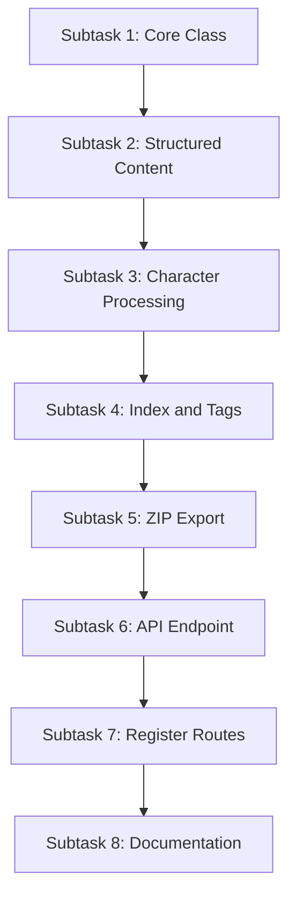

# Yomitan Dictionary Generator - Simplified Plan

## Overview

Generate a Yomitan-compatible dictionary from VNDB character data. The dictionary:
- Is named **"GSM (Do not delete)"** - a persistent dictionary that auto-updates
- Combines characters from the **3 most recently played games**
- Each character name (Japanese + aliases) becomes a dictionary entry with reading, image, and traits
- Supports **auto-update** via `downloadUrl` and `revision` fields in index.json

## Auto-Update Mechanism

The dictionary supports automatic updates via Yomitan's built-in update system:
- `revision`: Set to current date (e.g., "2026.01.01") - changes trigger update detection
- `downloadUrl`: Points to `http://127.0.0.1:{port}/api/yomitan-dict` for auto-download
- When user checks for updates, Yomitan compares revisions and downloads new version if different

## Subtasks for LLM Subagents

Each subtask is designed to be executed independently by an LLM with ~180k context. Each includes:
- Required context files to read
- Clear deliverable
- Verification criteria

---

### Subtask 1: Create YomitanDictBuilder Core Class

**Context Files Needed:**
- None (standalone implementation)

**Deliverable:** `GameSentenceMiner/util/yomitan_dict.py`

**Description:**
Create the `YomitanDictBuilder` class with:
1. `__init__(self, title: str = "GSM (Do not delete)", revision: str = None)` - Initialize dictionary metadata
2. `_decode_image(self, base64_data: str, char_id: str) -> tuple[str, bytes]` - Strip data URI prefix, decode base64 to bytes, return (filename, bytes)
3. Internal storage for entries, images, and metadata

**Class Structure:**
```python
class YomitanDictBuilder:
    DICT_TITLE = "GSM (Do not delete)"
    
    def __init__(self, revision: str = None, download_url: str = None):
        self.title = self.DICT_TITLE
        self.revision = revision or datetime.now().strftime("%Y.%m.%d")
        self.download_url = download_url  # For auto-update support
        self.entries = []  # Term bank entries
        self.images = {}   # char_id -> (filename, bytes)
        self.tags = set()  # Role tags used
        self.game_titles = []  # Track which games are included

    def _decode_image(self, base64_data: str, char_id: str) -> tuple[str, bytes]:
        # Strip "data:image/jpeg;base64," prefix if present
        # Decode and return (filename, image_bytes)
        pass
```

**Verification:** File exists with class skeleton, can be imported without errors.

---

### Subtask 2: Implement Structured Content Builder

**Context Files Needed:**
- `GameSentenceMiner/util/yomitan_dict.py` (from Subtask 1)

**Deliverable:** Add `_build_structured_content` method to `YomitanDictBuilder`

**Description:**
Build Yomitan structured content for a character card. The layout should look like a proper dictionary entry:
1. **Header**: Japanese name (large) with romaji reading below
2. **Image**: Character portrait (if available)
3. **Info Section**: Role, sex, age, physical stats
4. **Personality**: Bullet list of traits
5. **Description**: Collapsible section with character description

```python
def _build_structured_content(self, char: dict, image_path: str | None, game_title: str) -> dict:
    # Returns Yomitan structured content object
    # Layout: name/reading header, image, info, personality, description
```

**Structured Content Format:**
```python
{
    "type": "structured-content",
    "content": [
        # Header with name and reading (dictionary style)
        {"tag": "div", "style": {"fontWeight": "bold", "fontSize": "1.2em"}, "content": "田中花子"},
        {"tag": "div", "style": {"fontStyle": "italic", "color": "#666"}, "content": "Tanaka Hanako"},
        # Image (if available)
        {"tag": "img", "path": "img/c12345.jpg", "width": 80, "height": 100, ...},
        # Game title (which VN this character is from)
        {"tag": "div", "style": {"fontSize": "0.9em", "color": "#888"}, "content": "From: Game Title"},
        # Role badge
        {"tag": "span", "style": {"background": "#...", "padding": "2px 6px"}, "content": "Main Character"},
        # Stats (sex, age, height, blood type)
        {"tag": "div", "content": [...]},
        # Personality traits as bullet list
        {"tag": "ul", "content": [...]},
        # Collapsible description
        {"tag": "details", "content": [...]}
    ]
}
```

**Verification:** Method returns valid structured content dict for a sample character.

---

### Subtask 3: Implement Character Entry Processing

**Context Files Needed:**
- `GameSentenceMiner/util/yomitan_dict.py` (from Subtasks 1-2)
- `GameSentenceMiner/util/vndb_api_client.py` lines 268-372 (character data structure reference)

**Deliverable:** Add `add_character`, `add_game_characters`, and `_get_score` methods

**Description:**
```python
def _get_score(self, role: str) -> int:
    # main=100, primary=75, side=50, appears=25
    pass

def add_character(self, char: dict, game_title: str) -> None:
    # 1. Extract name_original (Japanese) as primary term
    # 2. Use romaji name as reading (for display)
    # 3. Decode image if present
    # 4. Build structured content (includes game_title for context)
    # 5. Create term entry [term, reading, tags, rules, score, definitions, sequence, termTags]
    # 6. Create additional entries for each alias
    pass

def add_game_characters(self, game: GamesTable) -> int:
    # Add all characters from a single game
    # 1. Parse vndb_character_data JSON
    # 2. Extract game title for display
    # 3. Loop through all character categories (main, primary, side, appears)
    # 4. Call add_character for each
    # 5. Return count of characters added
    pass
```

**Term Entry Format:**
```python
[
    "田中花子",           # term - Japanese name (kanji)
    "たなかはなこ",        # reading - romaji/kana if available
    "name main",         # definitionTags - role tags
    "",                  # rules - empty for names
    100,                 # score - based on role
    [structured_content], # definitions - includes image below reading
    1,                   # sequence - grouping number
    ""                   # termTags
]
```

**Verification:** Can add a character and entries list contains correct number of entries (1 + aliases).

---

### Subtask 4: Implement Index and Tag Bank Generation

**Context Files Needed:**
- `GameSentenceMiner/util/yomitan_dict.py` (from Subtasks 1-3)

**Deliverable:** Add `_create_index` and `_create_tag_bank` methods

**Description:**
```python
def _create_index(self) -> dict:
    # Build description from included game titles
    games_desc = ", ".join(self.game_titles) if self.game_titles else "No games"
    
    index = {
        "title": self.title,  # "GSM (Do not delete)"
        "revision": self.revision,  # Current date: "2026.01.01"
        "format": 3,
        "author": "GameSentenceMiner",
        "description": f"Character names from: {games_desc}"
    }
    
    # Add downloadUrl for auto-update support
    if self.download_url:
        index["downloadUrl"] = self.download_url
    
    return index

def _create_tag_bank(self) -> list:
    # Return list of tag definitions
    # Format: [name, category, order, notes, score]
    return [
        ["name", "partOfSpeech", 0, "Character name", 0],
        ["main", "name", 0, "Protagonist", 0],
        ["primary", "name", 0, "Main character", 0],
        ["side", "name", 0, "Side character", 0],
        ["appears", "name", 0, "Minor appearance", 0]
    ]
```

**Verification:** Methods return valid dict/list structures. Index includes downloadUrl when provided.

---

### Subtask 5: Implement ZIP Export

**Context Files Needed:**
- `GameSentenceMiner/util/yomitan_dict.py` (from Subtasks 1-4)

**Deliverable:** Add `export` method and `export_bytes` method

**Description:**
```python
def export(self, output_path: str) -> str:
    # Write ZIP to file, return path
    pass

def export_bytes(self) -> bytes:
    # Return ZIP as bytes for HTTP response
    # 1. Create in-memory ZIP with maximum compression
    # 2. Add index.json
    # 3. Add term_bank_1.json (split if >10000 entries)
    # 4. Add tag_bank_1.json
    # 5. Add img/ folder with all character images
    pass
```

**ZIP Structure:**
```
dictionary.zip
├── index.json
├── term_bank_1.json
├── tag_bank_1.json
└── img/
    ├── c12345.jpg
    └── c12346.jpg
```

**Verification:** Can create a valid ZIP file that Yomitan can import.

---

### Subtask 6: Backend API Endpoint

**Context Files Needed:**
- `GameSentenceMiner/util/yomitan_dict.py` (complete)
- `GameSentenceMiner/util/vndb_api_client.py` lines 374-452 (process_vn_characters method)
- `GameSentenceMiner/web/__init__.py` (full file, ~12 lines - shows route registration pattern)
- `GameSentenceMiner/util/db.py` lines 520-600 (GameLinesTable class definition)
- `GameSentenceMiner/util/games_table.py` lines 1-100 (GamesTable class definition and fields)
- `GameSentenceMiner/util/configuration.py` lines 1-50 (for get_config and port access)

**Deliverable:** `GameSentenceMiner/web/yomitan_api.py`

**Description:**
Create API endpoint for dictionary generation. The endpoint:
1. Automatically gets the 3 most recently played games (by max timestamp in game_lines)
2. Combines all characters from those games into a single dictionary
3. Sets revision to current date for auto-update detection
4. Includes downloadUrl pointing back to this endpoint (port from `get_config().general.texthooker_port`)

```python
from flask import jsonify, make_response
from typing import List

from GameSentenceMiner.util.yomitan_dict import YomitanDictBuilder
from GameSentenceMiner.util.db import GameLinesTable
from GameSentenceMiner.util.games_table import GamesTable
from GameSentenceMiner.util.configuration import get_config


def get_recent_games(limit: int = 3) -> List[GamesTable]:
    """
    Query game_lines for most recent activity per game.
    Returns games ordered by most recent line timestamp.
    """
    query = '''
        SELECT game_id, MAX(timestamp) as last_played
        FROM game_lines
        WHERE game_id IS NOT NULL AND game_id != ''
        GROUP BY game_id
        ORDER BY last_played DESC
        LIMIT ?
    '''
    rows = GameLinesTable._db.fetchall(query, (limit,))
    
    games = []
    for row in rows:
        game_id = row[0]
        game = GamesTable.get(game_id)
        if game and game.vndb_character_data:
            games.append(game)
    
    return games


def register_yomitan_api_routes(app):
    """Register Yomitan dictionary API routes with the Flask app."""
    
    @app.route("/api/yomitan-dict")
    def generate_yomitan_dict():
        """
        Generate Yomitan dictionary ZIP from recent games' character data.
        ---
        tags:
          - Yomitan
        responses:
          200:
            description: ZIP file containing Yomitan dictionary
          404:
            description: No games with VNDB character data found
        """
        # 1. Get 3 most recently played games
        recent_games = get_recent_games(limit=3)
        
        if not recent_games:
            return jsonify({"error": "No games with VNDB character data found"}), 404
        
        # 2. Build dictionary combining all games
        port = get_config().general.texthooker_port
        download_url = f"http://127.0.0.1:{port}/api/yomitan-dict"
        builder = YomitanDictBuilder(download_url=download_url)
        
        for game in recent_games:
            if game.vndb_character_data:
                builder.add_game_characters(game)
        
        if not builder.entries:
            return jsonify({"error": "No characters found in recent games"}), 404
        
        # 3. Return ZIP as file download with CORS headers
        zip_bytes = builder.export_bytes()
        response = make_response(zip_bytes)
        response.headers["Content-Type"] = "application/zip"
        response.headers["Content-Disposition"] = "attachment; filename=gsm_characters.zip"
        response.headers["Access-Control-Allow-Origin"] = "*"
        return response
```

**Verification:**
- API endpoint `/api/yomitan-dict` returns ZIP file with characters from recent games
- Response includes proper CORS headers
- Dictionary name is "GSM (Do not delete)"
- Revision is current date

---

### Subtask 7: Register API Routes in Flask App

**Context Files Needed:**
- `GameSentenceMiner/web/yomitan_api.py` (from Subtask 6)
- `GameSentenceMiner/web/__init__.py` (full file - route registration pattern)

**Deliverable:** Update `GameSentenceMiner/web/__init__.py` to register yomitan routes

**Description:**
Add import and route registration following the existing pattern in `__init__.py`:

```python
from GameSentenceMiner.web.texthooking_page import app
from GameSentenceMiner.web.database_api import register_database_api_routes
from GameSentenceMiner.web.jiten_database_api import register_jiten_database_api_routes
from GameSentenceMiner.web.stats_api import register_stats_api_routes
from GameSentenceMiner.web.goals_api import register_goals_api_routes
from GameSentenceMiner.web.anki_api_endpoints import register_anki_api_endpoints
from GameSentenceMiner.web.yomitan_api import register_yomitan_api_routes  # ADD THIS

register_database_api_routes(app)
register_jiten_database_api_routes(app)
register_stats_api_routes(app)
register_goals_api_routes(app)
register_yomitan_api_routes(app)  # ADD THIS
```

**Verification:** Server starts without errors, endpoint `/api/yomitan-dict` is accessible.

---

### Subtask 8: First-Time Setup Documentation

**Context Files Needed:**
- None (documentation only)

**Deliverable:** Add user documentation for first-time dictionary setup

**Description:**
Users need to manually import the dictionary once, then it auto-updates:

1. **First-time import:**
   - Navigate to `http://127.0.0.1:{port}/api/yomitan-dict` in browser
   - Download the `gsm_characters.zip` file
   - Import into Yomitan via Settings → Dictionaries → Import
   - The dictionary appears as "GSM (Do not delete)"

2. **Auto-updates:**
   - Yomitan checks `downloadUrl` when user clicks "Check for updates"
   - If `revision` (date) differs, Yomitan downloads new version automatically
   - Dictionary is replaced with fresh data from 3 most recent games

3. **Manual refresh:**
   - User can also manually download from the endpoint at any time
   - Re-importing replaces the existing dictionary

**Verification:** Documentation is clear and complete.

---

## Execution Order



## Notes for Subagents

1. **Dictionary Name:** Must be exactly "GSM (Do not delete)" - this is important so users know not to delete it.

2. **Entry Layout:** Each entry should look like a proper dictionary:
   - Term: Japanese name (kanji)
   - Reading: Romaji name (for pronunciation)
   - Content: Image first, then character info below

3. **Multi-Game Support:** Characters from multiple games are combined into one dictionary. Each entry includes the game title so users know which VN the character is from.

4. **Missing Data Handling:**
   - Skip image in structured content if `image_base64` is missing
   - Use romanized name as term if `name_original` is empty
   - Skip games without `vndb_character_data`

5. **Aliases:** Each alias creates a separate dictionary entry pointing to the same structured content.

6. **Error States:** API should return JSON error with appropriate HTTP status codes for:
   - No recent games found with character data
   - No characters found in any of the games

7. **CORS Headers:** Required for Yomitan to fetch from localhost. Include `Access-Control-Allow-Origin: *`.

8. **Revision Format:** Use date format "YYYY.MM.DD" (e.g., "2026.01.01") for version tracking.
